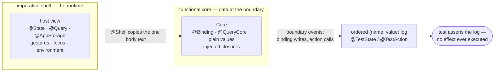

# Data Flow Masterclass

A SwiftUI app is a network of nodes — views and view modifiers. Data flows
through the network at exactly one moment: node creation. Everything else a
node does — writes, calls — is a boundary event that may or may not trigger
the next wave of creation. This article states that model precisely; the
`CoreFlow` macros in this repository mechanize it.

## The model

Flow-Based Programming (J. Paul Morrison, 1970s): a system is independent
nodes communicating only through flows of discrete data packets. Structured
design (Yourdon & Constantine, 1979) names the discipline: **data
coupling** — modules depending on each other only through plain values —
the loosest coupling that works. No shared mutable object, no protocol both
sides must know, no hidden channel.

SwiftUI is this model with one specific execution scheme:

- `body` is a **transformation**: input data in, child nodes out — created,
  with data entering their inits.
- The runtime **retains the network** those creations describe — identity,
  position, attached storage. The node *values* are ephemeral: created,
  read, discarded, every wave.
- The rhythm is **creation → transformation → creation**. The runtime
  tracks what each transformation read and re-runs exactly the ones whose
  inputs changed.

The framework already couples nodes by data. The discipline is refusing to
add any other coupling on top.

## One node's anatomy

```swift
struct BookRow: View {
    let title: String                            // in — at creation
    let author: String                           // in — at creation
    @State private var isFavorite: Bool = false  // self-loop, not an edge

    var body: some View { ... }                  // out — creates the children
}
```

**In, from the caller, at creation.** Plain values. A `Binding` — itself
data, a get/set pair pointing at storage, not a channel with a backward
direction. A `@ViewBuilder` subtree, as a value. Closures, as values —
`onSubmit` is data until called.

**In, from the runtime, at creation.** `@State` reads the node's own
storage: a self-loop — a write now is the value read at the next creation.
The storage survives the waves because it hangs off the retained identity,
not the ephemeral value; that's why it's private and never a caller's.
`@Environment` reads what an ancestor installed. `@Query` reads the store.

**Out.** `body`'s return value: the creation of the children, data entering
their inits. The only outbound flow there is.

## Boundary events

A binding write mutates the storage it points at. An action call is a
function call — control leaves the node, carrying a plain payload. Neither
is data flow. Parameters move on every call; movement is not the criterion.

The criterion: **does the event change a source of truth some node reads?**

- A binding write — always. Next wave follows, through the nodes reading
  that storage.
- `onDelete` deleting a `Book` from the `ModelContext` — yes: `@Query`'s
  result changes, and the next wave can *reshape* the tree. A row gone.
- A fire-and-forget network request — no. The payload left the data-flow
  world; a response re-enters only as a later write into some source of
  truth.

Most waves reshape nothing — same structure, new values. Structural change
is the rare, heavy case. Either way the loop closes through storage and
re-creation, never through a backward edge.

What keeps action calls *data-coupled*: plain-value payload, injected
closure, the node independent of what the action does. So a node's complete
observable behavior is the children it creates plus its boundary events —
the mutations it performs, the calls it makes, their payloads. That
sentence is the definition of testing, below.

## Data or machinery

Apple's property wrappers divide in two.

**Data-holding sources of truth** — `@State`, `@AppStorage`,
`@SceneStorage`, `@Query`. What they hold is a plain value: a `Bool`, a
`String`, a `[Book]`. Data can move — handed in, captured, asserted on.

**UI-runtime machinery** — `@GestureState` (a live gesture's lifecycle),
`@FocusState` (the focus system), `@Namespace` (view identity),
`@ScaledMetric` (display metrics), `@Environment` (the tree's own value
propagation). None hold data a caller could supply — there is no handing in
a live gesture. They only mean anything inside a running render pipeline.

Only the first kind can ever leave the view.

## Functional core, imperative shell

Bernhardt's "Boundaries": pure logic inside, I/O at the edges. Wlaschin:
push I/O to the boundaries. Seemann: the impureim sandwich. A SwiftUI view
with live wrappers is the shell — `@State` installs real storage on render,
`@Query` talks to a real `ModelContext` — and that I/O is fused into the
type. It cannot be unit-tested.

The `@Shell` macro extracts the core. Three rules:

1. **Plain fields copy as-is.** Already data.
2. **Data-holding wrappers become injectable stand-ins.**
   `@State`/`@AppStorage`/`@SceneStorage` → `@Binding`;
   `@Query` → `@QueryCore`, same read surface as the live wrapper, fetched
   array handed in as a plain value. The data I/O moves to the boundary.
3. **Machinery copies verbatim.** No substitution is possible — the
   declarations ride along byte-for-byte: live when `Core` is hosted, inert
   defaults otherwise.

Then `body` and every helper copy verbatim. One source text, two types —
the host runs it against the runtime, `Core` compiles the identical text
against injected boundaries. Drift is impossible.

```swift
@Shell
struct BookList: View {
    @Query private var books: [Book]
    @AppStorage("sortByAuthor") private var sortByAuthor: Bool = false
    let onDelete: (String) -> Void

    var body: some View { ... }   // written once, against the live wrappers
}

// generated:
// struct BookList.Core: View {
//     @QueryCore var books: [Book]        // fetched array injected as data
//     @Binding var sortByAuthor: Bool     // storage injected as a binding
//     let onDelete: (String) -> Void
//     var body: some View { ... }         // the same text, compiler-copied
// }

BookList.Core(books: [dune, anathem], sortByAuthor: .constant(false),
              onDelete: { _ in })          // no ModelContainer, no render loop
```

`Core` holds no state and executes no effects. Its entire behavior:
creating child nodes, plus boundary events carrying plain data.

## Testing is reading the execution log

How would Apple test `Button`? Its entire contract is "a physical tap calls
the action closure" — nothing inside to inspect. The only meaningful test:
hand it an action that *logs*, tap it for real, check the log. Literally:

```swift
struct ButtonTestHost: View {
    @TestAction var action: () -> Void = {}   // inert — reading it IS the logged action

    var body: some View {
        Button("Save", action: action)
    }
}

ButtonTestHost()
    .testLog { name, _ in
        // append name to the history
    }

// UI test: tap "Save", then inspect the history: ["action"]
```

Every `Core` has `Button`'s shape, so every `Core` tests that way. Mock
each boundary with a logger, drive the component, assert the ordered log of
writes and calls. The log is the behavior.

`@TestState` is a drop-in `@State` whose setter logs every write — direct
and through `$name` alike — at the write site. `@TestAction` makes reading
the property return the stored closure wrapped with logging: each call logs
its payload, then forwards. A *scenario* — a small test-host view — wires
them to a `Core`; both log through one environment seam, installed once
at the root via `testLog`:

```swift
struct AddBookScenario: View {
    @TestState var title = ""
    @TestAction var onSubmit: (String) -> Void = { _ in }   // deliberately inert

    var body: some View {
        AddBookField.Core(title: $title, onSubmit: onSubmit)
    }
}
```

The action is a no-op on purpose: the test wants the evidence, not the
effect. A UI test drives the live scenario — real touches, real
keystrokes — and asserts the exact sequence:

```swift
field.tap()
field.typeText("Dune")
app.buttons["addButton"].tap()

// names:  ["title","title","title","title","title","title",
//          "title","title","title","title","onSubmit","title"]
// values: ["","","D","D","Du","Du","Dun","Dun","Dune","Dune","Dune",""]
```

No screenshot carries that much truth: two binding writes per keystroke
(`TextField`'s real behavior, pinned as-is), the submit call carrying the
full title, the clear as the final write. One equality check.

Two rules keep it sound:

- **Effects log, getters don't.** Writes and calls fire on the component's
  own timing — deterministic. Reads fire on the render scheduler's timing —
  nondeterministic, and one such line poisons an exact-sequence assertion.
- **Two levels, same assertion surface.** Construct a `Core` directly for
  unit reach — fields, helpers, one `body` evaluation. Host it in a
  scenario for live reach — real `@State` installation, real keystroke
  round-trips.

## Data wants structural types

Data coupling needs data shapes, and a named type per field combination is
type explosion. Swift's tuples are structural — same element types, same
type, wherever they came from. `@Flowable` builds on that: the memberwise
`init` Swift won't synthesize (`public` for a public type, any at all for a
class or actor), plus two tuple typealiases over the same properties —
`InFlowSplat`, unlabeled, so any structurally-compatible tuple splats into
the `makeFlow(_:)` factory; `InFlow`, its labeled, `Mirror`-reflectable
twin.

Behavior bundles the same way. Wlaschin's capability-based design: hand a
consumer exactly the functions it may call, as plain values — not the whole
object, not a protocol to conform to. `@Capability` bundles a type's
computed properties and methods into one tuple-typed `capability` value;
`#pick` projects fields from one or more sources into a fresh tuple.

## What this rules out

ViewModels. An `ObservableObject` bolted onto the graph is object coupling:
a shared mutable box, opaque to SwiftUI's dependency tracking and to any
snapshot of plain values. The view *is* the view model — stored properties
in, boundary events out. `@StateObject` and `@ObservedObject` get no
stand-in on `Core`, ever; they copy verbatim like any unknown wrapper.
Testable state is modeled as data.

## The whole flow, one picture



## Vocabulary

| Term | Meaning |
|---|---|
| **node** | a view or view modifier — an ephemeral value, created fresh each wave |
| **network** | what the runtime retains across waves: identity, position, attached storage |
| **flow** | data entering inits at node creation — the only flow there is; one direction, downward |
| **transformation** | `body`: input data in, child nodes created |
| **wave** | one pass of re-creation — the runtime re-runs exactly the transformations whose inputs changed |
| **source of truth** | storage some node reads — `@State`, `@AppStorage`, `@SceneStorage`, `@Query`; changing one triggers the next wave |
| **self-loop** | `@State`: a write now is the value read at the node's next creation — an edge to itself, not to another node |
| **boundary event** | a binding write or an action call — not flow; re-enters the flow only if it changes a source of truth |
| **reshaping** | a wave that changes structure, not just values — branches appearing, rows vanishing; the rare case |
| **machinery** | Apple's UI-runtime wrappers that hold no suppliable data — gestures, focus, namespaces, metrics, environment |
| **shell / core** | the live host with its runtime I/O / its extracted twin with all data I/O injected at the boundary |
| **scenario** | a small test-host view wiring logging mocks to a `Core` |
| **execution log** | the ordered `(name, value)` record of boundary events — the component's behavior, as data |

## References

Data-flow programming and data coupling:

- J. Paul Morrison — [Flow-Based Programming](https://jpaulmorrison.com/fbp/) (book, 2nd ed. 2010) — the original model: a system as independent nodes communicating through flows of discrete data packets
- Edward Yourdon & Larry Constantine — *Structured Design* (1979) — the coupling taxonomy this article's "data coupling" comes from: of all the ways two modules can depend on each other, passing plain data is the loosest that works
- Ian Cooper — [Hustle and Flow](https://www.youtube.com/watch?v=p0bKMuBdpL8) (NDC Porto 2022) — Morrison's model resurrected for modern event-driven architecture
- Ian Cooper — [Succeeding at Reactive Architecture](https://www.youtube.com/watch?v=YyWKczrfxW4) (NDC London 2023) — the reactive properties, and message/data passing as the coupling discipline that unlocks them

State, complexity, and the retained recomputation network:

- Ben Moseley & Peter Marks — [Out of the Tar Pit](https://curtclifton.net/papers/MoseleyMarks06a.pdf) (2006) — mutable state as the dominant source of accidental complexity; keep logic pure, corral state at the edges
- Umut Acar — [Self-Adjusting Computation](https://www.cs.cmu.edu/~rwh/students/acar.pdf) (PhD thesis, CMU 2005) — the theory of re-running exactly the computations whose inputs changed, over a retained dependency graph
- Jane Street — [Introducing Incremental](https://blog.janestreet.com/introducing-incremental/) — the same idea as a practical library: a retained computation graph, waves of recomputation through it
- Apple — [Demystify SwiftUI](https://developer.apple.com/videos/play/wwdc2021/10022/) (WWDC21) — identity, lifetime, and dependencies: Apple's own telling of the retained network with ephemeral view values
- Apple — [Data Essentials in SwiftUI](https://developer.apple.com/videos/play/wwdc2020/10040/) (WWDC20) — sources of truth and how data drives the graph

The same unidirectional model in other UI frameworks:

- React — [Thinking in React](https://react.dev/learn/thinking-in-react) — one-way data flow: state down through construction, events triggering re-render
- Elm — [The Elm Architecture](https://guide.elm-lang.org/architecture/) — the whole UI as a pure function of data, mutations only through a single update path

Functional core, imperative shell:

- Gary Bernhardt — [Boundaries](https://www.destroyallsoftware.com/talks/boundaries)
- Scott Wlaschin — [Six approaches to dependency injection](https://fsharpforfunandprofit.com/posts/dependencies/) (pushing I/O to the edges)
- Mark Seemann — [Impureim sandwich](https://blog.ploeh.dk/2020/03/02/impureim-sandwich/)

Capability-based design:

- Scott Wlaschin — [Designing with capabilities](https://fsharpforfunandprofit.com/cap/)

Against ViewModels/`ObservableObject` in SwiftUI:

- Apple Developer Forums — [Stop using MVVM for SwiftUI](https://developer.apple.com/forums/thread/699003)
- karamage — [Stop using MVVM with SwiftUI](https://medium.com/@karamage/stop-using-mvvm-with-swiftui-2c46eb2cc8dc)
- Azam Sharp — [SwiftUI Architecture: A Complete Guide to the MV Pattern Approach](https://medium.com/better-programming/swiftui-architecture-a-complete-guide-to-mv-pattern-approach-5f411eaaaf9e) ("the View is the view model")
