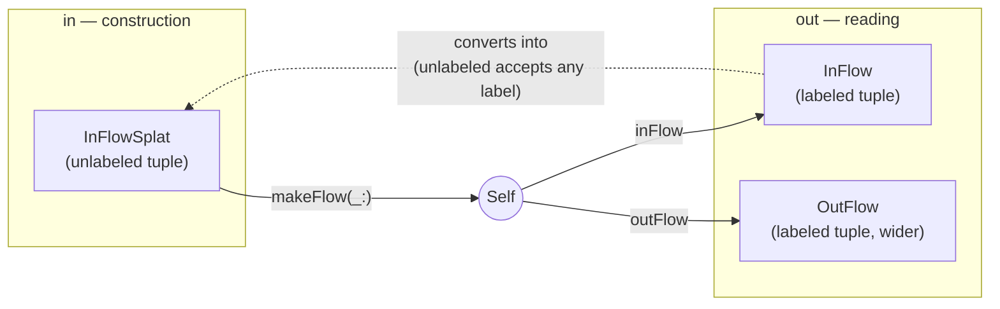

# DataMacros

A small, growing collection of independent Swift macros, all shipped from one
library — a single dependency gets you every macro below:

```swift
// Package.swift
.package(url: "https://github.com/<you>/DataMacros", from: "1.0.0"),

// target dependency
.product(name: "DataMacros", package: "DataMacros"),
```

Requires Swift 6.3+ (`swift-tools-version: 6.3`). Builds across the whole swift-syntax
6xx line. Run everything with `swift build && swift test`; see every macro exercised
together in `Sources/Examples/main.swift` (`swift run Examples`).

## What's inside

| Macro | Form | Does |
|---|---|---|
| [`@DataLayout`](#datalayout) | member | writes a memberwise `init` at the type's own access level, plus `InFlowSplat`/`InFlow` typealiases bundling the same properties into a tuple, unlabeled and labeled, plus a wider `OutFlow` for a private-state-inclusive view |
| [`@StatelessNode`](#statelessnode) | member | a separate macro from `@DataLayout` (doesn't replace `OutFlow`) generating a nested, nominal `StatelessNode` struct over the same wider field set — real `Equatable`/`Codable`/protocol conformance a tuple can never have |
| [`@Capability`](#capability) | member | bundles every eligible computed property/method into a `Capability` tuple + computed property — works on an extension |
| [`#pick`](#pick-tuplepicker) | expression | projects one or more fields — via KeyPath — from one or more sources into a single tuple |
| [`Reflector`](#reflector) | runtime utility (not a macro) | lists a value type's field names off its type alone, no instance needed — pairs with `@DataLayout`'s `InFlow` |

---

## DataLayout

A `member` macro that writes a memberwise `init` for the type it's attached to, **at
the type's own access level**. It fills the initializers Swift won't synthesize: the
`public init` a public struct needs, and *any* init for a `class` or `actor` —
including an `@Observable final class`. Alongside the init, it also declares two
typealias/accessor pairs — an unlabeled `InFlowSplat` with a `makeFlow(_:)`
factory building `Self` back *from* one, and a labeled `InFlow` with an
`inFlow` computed property reading the current instance's data back *out* —
plus a wider `OutFlow`/`outFlow` pair mixing `InFlow`'s
fields with a view's own externally-relevant private state. See
[below](#the-inflowsplat-typealias), [below that](#the-makeflow_-factory),
[below that](#the-inflow-typealias), [below that](#the-inflow-property), and
[below that](#the-outflow-typealias-and-outflow-property).

See the [diagram below](#how-inflow-and-outflow-relate) for how the whole shape
fits together.

```swift
@DataLayout
public struct User {
    public let id: UUID
    public var isActive: Bool = false
}
// generates:
// public init(id: UUID, isActive: Bool = false) {
//     self.id = id
//     self.isActive = isActive
// }
// public typealias InFlowSplat = (UUID, Bool)
// public static func makeFlow(_ flow: InFlowSplat) -> Self {
//     Self(id: flow.0, isActive: flow.1)
// }
```

Works the same on a `class` or `actor`:

```swift
@DataLayout
@Observable final class Counter {
    var count: Int = 0
}
// init(count: Int = 0) { self.count = count }
// typealias InFlowSplat = Int          // one property → bare type, not a 1-tuple
// static func makeFlow(_ flow: InFlowSplat) -> Self { Self(count: flow) }
```

### What it does

- **Mirrors the access level** — `public struct` → `public init`, an internal type →
  unmodified `init`, and so on.
- **`var` defaults carry through** — `var x: Int = 0` → parameter `x: Int = 0`. An
  optional `var` is implicitly nil-initialized, so `var name: String?` → parameter
  `name: String? = nil`, just like Swift's own memberwise init.
- **Function-typed properties get `@escaping`**, attributed types included
  (`@MainActor () -> Void`, `@Sendable (Int) -> Void`). Optional closures
  (`(() -> Void)?`) pass through as-is — they're already escaping.
- **Skips** computed properties and `static`/`class` members; keeps stored properties
  that have only `willSet`/`didSet` observers.

### SwiftUI

- **`private` properties are excluded** from the init. Since SwiftUI's view-owned
  wrappers — `@State`, `@Environment`, `@StateObject`, … — are always `private`, they
  fall out automatically. No configuration, no per-wrapper list.
- **`@Binding`** is threaded in as a projected `Binding<T>` parameter, assigned to the
  backing storage (`self._x = x`).
- **`@ViewBuilder`** carries onto the parameter so callers get trailing-closure syntax.
  A stored closure (`let content: () -> Content`) becomes `@ViewBuilder content: @escaping () -> Content`;
  a stored value (`let footer: Content`) becomes `@ViewBuilder footer: () -> Content` and the
  init calls it (`self.footer = footer()`).

```swift
@DataLayout
struct Card<Content: View>: View {
    @Environment(\.colorScheme) private var scheme   // excluded (private)
    @State private var expanded = false              // excluded (private)
    @Binding var isOn: Bool                           // init param: Binding<Bool>
    let title: String
    @ViewBuilder let footer: Content                  // init param: @ViewBuilder () -> Content

    var body: some View { /* ... */ }
}
// init(isOn: Binding<Bool>, title: String, @ViewBuilder footer: () -> Content)
```

### Design: for pure data

- **No type inference.** It's syntax-only: a non-private property that becomes a
  parameter needs an explicit type. `var count: Int = 0`, not `var count = 0` (the
  latter is a compile error).
- **No stored `let` constants.** A constant isn't per-instance data — use `static let`.
  The macro doesn't special-case an instance `let`: `let version: Int = 1` generates
  `self.version = version` (a `let`-reassignment error), and untyped `let version = 1`
  hits the missing-type rule above. Either way it won't compile.
- **`private` means private.** If a value is meant to be passed in, it isn't private.

### The InFlowSplat typealias

Alongside the init, `@DataLayout` declares `InFlowSplat` — the same properties
bundled into a tuple type, for API uniformity/discoverability (e.g. `Foo.InFlowSplat`
is always there to reference generically) rather than as a second constructor;
nothing in the init routes through it.

```swift
@DataLayout
public struct User {
    public let id: UUID
    public let name: String
}
// public typealias InFlowSplat = (UUID, String)

let flow: User.InFlowSplat = (id: someID, name: "Ada")
```

It's built independently of the init, so it diverges from it in a few ways:

- **Unlabeled** — `(UUID, String)`, not `(id: UUID, name: String)` — deliberately,
  so any structurally-compatible tuple converts into it, not just one built with
  these exact field names ("splat" in the name). Verified directly: a tuple
  *value* already bound with different labels (`let t = (xxx: 1, yyy: 2)`) fails
  to convert into a *labeled* tuple type of the same shape (`error: cannot
  convert value of type '(xxx: Int, yyy: Int)' to expected argument type '(x:
  Int, y: Int)'`), but succeeds once the target is unlabeled — Swift only
  enforces label agreement between two *labeled* tuple types. A labeled tuple
  *literal* (`(id: someID, name: "Ada")`, as above) converts into an unlabeled
  target either way, so you can still write field names for your own
  readability when constructing the value — only a pre-existing,
  differently-labeled variable needed the loosening. The real cost: with no
  labels, the compiler no longer catches two same-typed fields passed in the
  wrong order.
- **No per-field defaults.** Tuple element types can't carry `= default` — so an
  inline `var` default, and an optional `var`'s implicit `nil`, are both dropped,
  unlike the init right above it.
- **One property still gets an `InFlowSplat` — just not a tuple.** Swift has no
  1-tuples — `(Int)` as a type collapses to plain `Int` regardless of labels — so
  with exactly one participating property, `InFlowSplat` aliases the bare field
  type directly (`typealias InFlowSplat = Int`).
- **Zero properties → no typealias at all.** There's nothing to alias, and the init
  already covers the zero-property case on its own (`init() {}`).
- **Never `@escaping`**, even on function-typed fields — a closure nested inside a
  tuple type is already escaping; writing the attribute there is a compile error.
- **`@ViewBuilder` is ignored entirely.** A stored-value field
  (`@ViewBuilder let footer: Content`) keeps its own type in the typealias
  (`Content`, not `() -> Content`) and would be assigned directly if anything
  consumed it. The init wraps that field in a builder closure specifically to get
  trailing-closure syntax at the call site; a tuple type has no parameter position
  for that syntax to attach to, so the wrapping would buy nothing here — and would
  actively work against the point of `InFlowSplat`, which is data you pass
  around, store, or diff, not a closure.

### The makeFlow(_:) factory

A `static func makeFlow(_ flow: InFlowSplat) -> Self` that builds an instance from
an `InFlowSplat` value — declared whenever `InFlowSplat` itself is (same
collapse/absence rules). It forwards each field directly:

```swift
let flow: User.InFlowSplat = (id: someID, name: "Ada")
let user = User.makeFlow(flow)

// Any structurally-compatible tuple works, not just one built with these field
// names — InFlowSplat is unlabeled:
let differentlyLabeled = (uuid: someID, label: "Ada")
let user2 = User.makeFlow(differentlyLabeled)
```

- **A static function, not a second `init`** — deliberately, so it works the same on
  a struct, class, or actor. A delegating second `init` (`self.init(...)`) requires
  the `convenience` keyword on a class/actor and drags in Swift's
  designated/convenience init rules; a plain static function returning `Self(...)`
  sidesteps that entirely.
- **Direct field forwarding**, not a trick. `Self(x: flow.0, y: flow.1)`
  — not `[layout].map(Self.init).first!`, which is what you'd reach for by hand to
  get an *unapplied* `Self.init` reference to accept a tuple positionally (it works,
  but the macro doesn't need it: it already knows every field's position).
- **Fields are read positionally** — `flow.0`, `flow.1`, … in field
  order — since `InFlowSplat` itself is unlabeled.
- **A `@ViewBuilder`-stored value is the one field that isn't forwarded as-is.**
  `InFlowSplat` holds it as a plain value, but the primary init still wants a
  `() -> Content` builder for it — so `makeFlow(_:)` wraps it back into a
  trivial closure: `footer: { flow.2 }`.
- **Positional, unlabeled parameter (`_ flow:`)**, not a labeled `make(inFlowSplatted:)`
  — a deliberate naming choice, so the call site reads `Type.makeFlow(someFlow)`.

### The InFlow typealias

The reverse direction from `InFlowSplat`: the same fields and types, but **labeled**
— `(id: UUID, name: String)`, not `(UUID, String)`. Same collapse/absence rules
(one property → bare type, zero → nothing).

```swift
let named: User.InFlow = (id: someID, name: "Ada")
```

Labeled specifically for readable field access (`named.id`, not `named.0`) and real
reflection support — verified directly: `Mirror(reflecting:)` reports each field's
actual name over a *labeled* tuple, but only positional labels (`.0`, `.1`) over an
*unlabeled* one, so `InFlowSplat` alone can't back a generic field-name utility.
`InFlow` can — see [`Reflector`](#reflector) below.

### The inFlow property

A computed property extracting the *current* instance's values into an
`InFlow` — the reverse of `makeFlow(_:)`. Declared whenever
`InFlow` is.

```swift
let user = User(id: someID, name: "Ada")
user.inFlow   // (id: someID, name: "Ada")

// Round-trips through makeFlow(_:) with no manual conversion — an
// InFlow value converts into InFlowSplat's unlabeled parameter the same
// way any differently-labeled tuple does:
let copy = User.makeFlow(user.inFlow)
```

- Every field reads straight off `self` (`self.x`) — except `@Binding`, which
  reads its projected form (`self._x`) to match `InFlowSplat`'s `Binding<T>` field
  type.
- **No `@ViewBuilder` wrapping needed here**, unlike `makeFlow(_:)`'s reverse
  direction: a stored property already holds exactly its own declared type
  regardless of `@ViewBuilder` — that attribute only ever reshapes the *init
  parameter*, never the property's own storage.


### The OutFlow typealias and outFlow property

Wider than `InFlow`/`inFlow`: `InFlow`'s fields, **plus**
private `@Query`/`@State`/`@AppStorage` properties — a view's own
externally-relevant *capturable* state, alongside its public data. Everything
else private (a plain `private var cache = 0`, `@StateObject`, `@Environment`,
…) is excluded.

**Why this exists: testability.** Any SwiftUI node that owns or reads live state
via `@State`/`@Query`/`@AppStorage` introduces a source of truth that only
really works inside a live render pipeline — view identity, a real
`ModelContext`. That makes it hard to test directly. `OutFlow` converts that
state into a plain, stateless snapshot: construct the type, read `.outFlow`,
assert on the fields — no live view hierarchy needed. That's the actual point
of targeting exactly these wrapper kinds, not "expose private state" for its
own sake.

**`@Environment` is deliberately excluded.** Not because it's technically
uncapturable — a plain, unattributed value works fine, same as any other field,
and [`@StatelessNode`](#statelessnode) captures it exactly that way (see its section
below) — but because a captured snapshot goes stale the instant the real
environment changes, and `@Environment`'s own mocking story (inject a different
value where the type is constructed/hosted) already covers testing it without
this package's help. `@StatelessNode` makes the opposite call and captures it
anyway, for the same reason it treats every field uniformly.

```swift
@DataLayout
struct Card: View {
    @Query private var items: [Item]
    @State private var isExpanded: Bool = false
    let title: String
    // generates:
    // typealias OutFlow = (items: (result: [Item], fetchError: Error?, modelContext: ModelContext),
    //                       isExpanded: Binding<Bool>, title: String)
    // var outFlow: OutFlow {
    //     (items: (result: self.items, fetchError: self._items.fetchError, modelContext: self._items.modelContext),
    //      isExpanded: self.$isExpanded, title: self.title)
    // }
}
```

- **Declaration order, as one interleaved list** — not data-layout fields first
  with wrapper fields appended after. `items` comes first above because it's
  declared first.
- **`@Query` → always `(result: WrappedType, fetchError: Error?, modelContext:
  ModelContext)`, synthesized** — not a passthrough of the declared type.
  `WrappedType` is the property's own declared type (`[Item]` above);
  `fetchError`/`modelContext` are **real members of SwiftData's `Query`
  wrapper instance** (`self._items.fetchError`, `self._items.modelContext`) — not
  synthesized placeholders. Verified directly against the SwiftData interface:
  `Query<Element, Result>` declares `@MainActor @preconcurrency public var
  fetchError: (any Error)? { get }` and `public var modelContext: ModelContext {
  get }` on the wrapper instance itself.
- **`@State`/`@AppStorage` → `Binding<WrappedType>`**, read via the *projected*
  value (`self.$x`) — not `self._x`, which gives the wrapper instance itself
  (`State<T>`, not `Binding<T>`; verified directly).
- **`@Query`/`@State`/`@AppStorage` need an explicit type even though they're
  private** — every other private property is exempt from that rule, but
  `OutFlow` reads their type to build its field. (`@Environment` also needs an
  explicit type, for `@StatelessNode`'s sake, even though `OutFlow` itself no
  longer reads it.)
- **`@State`'s `Binding` doesn't write through outside a live SwiftUI view
  render** — verified directly: construct a `@DataLayout` type in plain code
  (never installed into a real view hierarchy) and mutate
  `outFlow.someStateField.wrappedValue` — it silently no-ops instead of
  persisting. That's `@State`'s own behavior, not a bug here; a genuine
  caller-supplied `@Binding` field, by contrast, really does write through.
- **On a `View`-conforming type, reading `outFlow` needs `@MainActor`** — `View`
  conformance implicitly infers `@MainActor` isolation for the whole type, so
  touching its members from a nonisolated context (a plain function, a
  non-`@MainActor` test) crosses that isolation boundary at runtime and can trap
  under Swift 6 strict concurrency. A plain top-level script doesn't hit this —
  top-level code already runs on the main actor.

### Testing a @DataLayout type's state

`OutFlow` in practice: construct the type directly, no `ModelContainer`, no
`WindowGroup`, no live rendering — just read `.outFlow` and assert:

```swift
@MainActor
@Suite struct CardTests {
    @Test func startsCollapsed() {
        let card = Card(title: "Settings")  // items/isExpanded are private, excluded from init
        #expect(card.outFlow.isExpanded.wrappedValue == false)
        #expect(card.outFlow.title == "Settings")
    }
}
```

`@MainActor` on the suite is required, not stylistic, whenever the type
conforms to `View` — see the bullet above. See
`Tests/DataMacrosTests/OutFlowTests.swift` for the real version of this pattern,
including the one genuine caveat: a `@State`-derived binding read through
`outFlow` doesn't write back outside a live view (see two bullets up) — reading
its *value* for assertions works fine, mutating it in a test doesn't stick.

An earlier revision also had an `allFieldNames` static var here, unconditionally
listing *every* stored property's name with no filtering — including plain
private fields with no recognized wrapper (`private var cache = 0`), which
never appear in `InFlowSplat`/`InFlow`/`OutFlow` either. It was removed once
it became clear [`Reflector`](#reflector) already covers the same need for any
*specific* generated tuple (`Reflector.fieldNames(of: SomeType.OutFlow.self)`,
say) without a dedicated member. The one real gap: a totally-private,
non-wrapper field still has no tuple anywhere to reflect over. Accepted as
YAGNI for now.

### How InFlow and OutFlow relate



- **`InFlowSplat`/`makeFlow(_:)`** — data flowing *in*, to build a `Self`.
- **`InFlow`/`inFlow`** — the same fields flowing back *out*, labeled for
  reading — and, since it's structurally the same shape as `InFlowSplat`
  minus labels, it converts right back into `makeFlow(_:)`'s parameter with no
  manual conversion.
- **`OutFlow`/`outFlow`** — a wider *out*, adding the view's own
  externally-relevant *capturable* private state (`@Query`/`@State`/
  `@AppStorage` — not `@Environment`, which isn't captured at all; see its own
  section above) alongside the same public fields `InFlow` has. There's no
  `OutFlow`-shaped *in* direction — nothing constructs a `Self` from private
  view state, so this side of the diagram is deliberately one-way.

**Why tuples, not a dedicated generated struct per type:** a tuple is a
*structural* type — two tuples with the same element types match regardless of
where they came from, with no shared nominal declaration needed. That's
exactly what a data-flow shape wants: `InFlow` and `InFlowSplat` need to
convert into each other, and any external, differently-labeled tuple needs to
splat into `makeFlow(_:)`, without this package generating (and you naming) a
bespoke struct type for every field combination across every `@DataLayout`
type. A nominal type would need its own declaration, its own name, and
explicit conversion code between every pair that should interoperate — an
independent named type *per shape*, i.e. type explosion. Tuples sidestep all
of it: the shape itself *is* the type.

---

## StatelessNode

A `member` macro, separate from `@DataLayout` — it doesn't replace `OutFlow`/
`outFlow`, and works with or without `@DataLayout` also attached (it collects the
type's stored properties itself). It generates a nested `StatelessNode` struct — which
carries `@DataLayout` itself — plus a `statelessNode` computed property building one
from the current instance, sharing its constructed-field set with what `OutFlow`
already computes, *plus* `@Environment` (which `OutFlow` deliberately leaves out
— see above — but `StatelessNode` still captures): every non-private participating
property, plus private `@Environment`/`@Query`/`@State`/`@AppStorage` state,
each captured once as a plain value.

```swift
@StatelessNode
struct Card: View {
    @Query private var items: [Item]
    @Environment(\.colorScheme) private var colorScheme: ColorScheme
    @State private var isExpanded: Bool = false
    let title: String
    var subtitle: String?
    // generates:
    // @DataLayout
    // struct StatelessNode {
    //     var items: (result: [Item], fetchError: Error?, modelContext: ModelContext)
    //     let colorScheme: ColorScheme
    //     @Binding var isExpanded: Bool
    //     let title: String
    //     var subtitle: String?
    // }
    // var statelessNode: StatelessNode {
    //     StatelessNode(items: (result: self.items, fetchError: self._items.fetchError,
    //                       modelContext: self._items.modelContext),
    //               colorScheme: self.colorScheme, isExpanded: self.$isExpanded,
    //               title: self.title, subtitle: self.subtitle)
    // }
}
```

### Why a nominal struct alongside `OutFlow`'s tuple

Tuples can't conform to protocols — verified directly against the real compiler:

```
type '(x: Int, y: String)' cannot conform to 'Equatable'
only concrete types such as structs, enums and classes can conform to protocols
```

So `OutFlow` alone can never be `Equatable`, `Codable`, or conform to a shared
"any stateless snapshot" protocol for generic code to work with. `StatelessNode` is a
real nominal struct capturing the same data, so it can — for free, the moment it's
declared as a real `struct`.

### Why `StatelessNode` carries `@DataLayout`, not hand-written members

Rather than re-deriving an init/accessors for the nested struct by hand,
`@StatelessNode` just declares `StatelessNode`'s stored properties and attaches
`@DataLayout` to it. A macro-generated declaration that itself carries another
macro's attribute really does get expanded by the compiler — verified directly
with a real build: a member macro emitting `@DataLayout public struct Snapshot {
... }` produces a fully working `inFlow`/`makeFlow(_:)`/`InFlowSplat` on
`Snapshot`, no different from writing it by hand. `@DataLayout`'s own
memberwise-init rendering does the rest, with no new init/accessor logic anywhere
in `@StatelessNode`'s own implementation.

### Every source-of-truth wrapper becomes a plain, constructed value

`@Query`, `@State`/`@AppStorage`, and `@Environment` all become ordinary fields
on `StatelessNode`, captured once rather than kept live — never the original
attribute, except `@State`/`@AppStorage`'s substitution into `@Binding`:

- **`@Query`** → the synthesized `(result:, fetchError:, modelContext:)` tuple,
  no attribute.
- **`@State`/`@AppStorage`** → `@Binding var name: T` — the one case that keeps
  an attribute, substituted rather than mirrored, since their storage only
  installs inside a live SwiftUI view and can't be redeclared as itself on a
  plain struct.
- **`@Environment`** → a plain `let name: T`, no attribute at all. Not because
  the value doesn't change — because the *attribute* can't be preserved:
  `@Environment`'s `wrappedValue` has no public setter (verified directly:
  `error: cannot assign to property: 'colorScheme' is a get-only property`),
  and `@DataLayout`'s init always assigns `self.x = x` — a plain, unattributed
  `let` has no such restriction. Always `let`, not mirroring the original's
  `let`/`var` (always `var`, every property wrapper requires it) — the
  captured copy is a one-time snapshot, immutable by design.

**These four must be private — enforced with a diagnostic, not accommodated.**
`@State`/`@Environment`/`@Query`/`@AppStorage` are a view's own source of
truth, never something a caller supplies (`@Binding` is for that); declaring
one non-private is a compile error, so every renderer downstream can assume
all four are always private, with no "what if it's also public" case to
reason about.

### The rule for everything else: mirror the original declaration, except `@Query`

Every field except `@Query` (and `@Environment`, above) is declared on
`StatelessNode` *exactly* as the original property was — same attribute (if it has
one), same declared type, same `let`/`var`. Only `@Query` (a synthesized
`(result:, fetchError:, modelContext:)` tuple) gets a genuinely different type,
with no attribute — everything else is a direct mirror, reusing `OutFlow`'s own
field-computing functions (`outFlowProperties`/`outFlowFieldType`/
`outFlowFieldReadExpression`) unchanged to decide *what* each field's type is.

This one rule covers several things at once:

- **A plain `var subtitle: String?` stays a mutable `var` on `StatelessNode`**, not a
  `let` — so a snapshot can be tweaked directly after construction, useful for
  setting up UI test/preview state without rebuilding it via `makeFlow(_:)`.
- **A genuine, already-public `@Binding` field mirrors verbatim** into exactly
  the same `@Binding var name: T` form `@State`/`@AppStorage` are substituted
  into above — it already *is* that declaration in the original source, so no
  extra logic is needed. `@DataLayout`'s existing `@Binding` handling (a
  `Binding<T>` init parameter, assigned to the backing `self._name` storage)
  picks up both cases identically. The payoff: `statelessNode.name` reads the
  wrapped value directly, no `.wrappedValue` unwrap — and `statelessNode.name =
  newValue` writes straight through to whatever storage the original binding
  pointed at, genuinely two-way.
- **`@ViewBuilder` mirroring is a real win here, unlike `OutFlow`'s tuple** —
  `OutFlow` has no parameter position for trailing-closure sugar to attach to,
  so it strips `@ViewBuilder` down to a bare type. `StatelessNode` has a real init
  (from its own `@DataLayout` expansion), so `@ViewBuilder` mirrored onto its
  field genuinely buys real builder syntax at `StatelessNode`'s own init call site.
- **`@Bindable` needs no special handling at all** — `@DataLayout`'s init logic
  never recognized `@Bindable` specially even on the *original* type (it just
  does `self.model = model`, legal since `@Bindable`'s wrappedValue is a plain
  get/set), so mirroring it onto `StatelessNode` reuses that exact unmodified path.

### Automatic `View`/`ViewModifier` detection

When the attached type's own inheritance clause spells `View` or `ViewModifier`,
`@StatelessNode` generates two more things beyond the usual struct/property pair:

```swift
@StatelessNode
struct Card: View {
    let title: String
    // generates, in addition to the usual StatelessNode struct/statelessNode property:
    // @DataLayout
    // struct StatelessNode: View { ... }       <- conformance declared, not implemented
    // var body: some View { self.statelessNode }   <- the mechanical delegation, for free
}

// only the real implementation is left to write by hand:
extension Card.StatelessNode {
    var body: some View { Text(title) }
}
```

`ViewModifier` works the same way — `struct VM: ViewModifier` gets `StatelessNode:
ViewModifier` plus `func body(content: Content) -> some View {
content.modifier(self.statelessNode) }`, going through `View.modifier(_:)` rather
than forwarding `content` directly into `StatelessNode`'s own `body(content:)`. That
detour is required, not stylistic: `ViewModifier.Content` is `typealias Content =
_ViewModifier_Content<Self>`, a generic struct keyed on the *conforming type
itself*, so `VM`'s own `Content` and `VM.StatelessNode`'s are different concrete
types — verified directly against the real compiler:

```
error: cannot convert value of type 'VM.Content' (aka '_ViewModifier_Content<VM>')
to expected argument type 'VM.StatelessNode.Content' (aka '_ViewModifier_Content<VM.StatelessNode>')
note: arguments to generic parameter 'Modifier' ('VM' and 'VM.StatelessNode') are expected to be equal
```

`.modifier(_:)` only needs its argument to conform to `ViewModifier`, not to
share a `Content` — it sidesteps the whole problem.

**This detection is syntactic, not semantic.** A macro never gets a type
checker, so it can only read the literal inheritance clause written on the
attached declaration itself — conformance added in a separate extension
elsewhere, via a typealias or protocol composition, or spelled with a
qualification (`SwiftUI.View`), is invisible to it. Only a bare `View`/
`ViewModifier` identifier directly on the attached type is recognized.

**How you're expected to discover you need to write that extension at all**:
`StatelessNode: View`/`: ViewModifier` only *declares* the requirement, so Swift's
own "does not conform to protocol" build error already forces the extension to
exist — but that error alone doesn't say *where* (extend `Card.StatelessNode`, not
`Card`). `@StatelessNode` also generates a doc comment directly on the `StatelessNode`
struct declaration, spelling out exactly what to write, visible via Quick
Help/jump-to-definition. Deliberately a doc comment, not a compiler diagnostic:
the macro has no way to know whether the extension already exists elsewhere in
the module, so a `.note`/`.warning` would either nag forever (never clears
once implemented) or never fire at all. A doc comment costs nothing once the
extension is written.

---

## Capability

A `member` macro that bundles every eligible **computed** property and method of the
type — or extension — it's attached to into one `Capability` tuple typealias and a
`capability` computed property: a lightweight "protocol witness"-style bundle of
*behavior*, as opposed to `@DataLayout`'s `InFlowSplat` typealias, which bundles
*data*.

```swift
struct Counter {
    private var count = 0
}

@Capability
extension Counter {
    var doubled: Int { count * 2 }
    func increment() { /* ... */ }
    func fetch() async throws -> Int { count }
}
// generates:
// typealias Capability = (doubled: Int, increment: () -> Void, fetch: () async throws -> Int)
// var capability: Capability {
//     (doubled, increment, fetch)
// }
```

### Works on an extension — unlike @DataLayout, on purpose

`@DataLayout` collects **stored** properties, and extensions can never declare
those — so there's nothing for it to find if attached to one; that's a hard Swift
rule, not a missing feature. `@Capability` collects **computed** members instead,
which extensions declare just as freely as a primary type body, so it works equally
well attached directly to a struct/class/actor or to an extension of one.

### What's collected

- **Computed properties** (`var x: Int { ... }`) — needs an explicit type
  annotation, same syntax-only reasoning as the other macros. Stored properties
  (including ones with only `willSet`/`didSet`) don't participate.
- **Instance methods** — turned into a closure type from the parameter types
  (labels dropped, matching how closure types work), `async`/`throws` effects, and
  return type (`Void` if omitted).
- **Skipped**: `private`/`fileprivate`, `static`/`class`, initializers, subscripts,
  and `mutating` methods — Swift can't form a plain closure reference to a mutating
  method on a value type, so including one would generate code that doesn't
  compile.

One eligible member collapses `Capability` to that member's bare type/value — same
1-tuple collapse `@DataLayout`'s `InFlowSplat` typealias does, for the same reason
(Swift has no 1-tuples). Zero eligible members is a diagnostic, not an empty
`Capability`.

### No `@Sendable`

The generated closure fields are deliberately **not** marked `@Sendable`. Verified
directly, both ways: marking them unconditionally makes the generated code fail to
compile for any type that captures something non-Sendable (a plain class reference,
say) — `error: converting non-Sendable function value to '@Sendable () -> Void' may
introduce data races`. Omitting it compiles cleanly regardless, and still permits
genuine cross-`Task`/actor usage in practice: Swift 6's region-based Sendable
checking runs at the point the tuple literal is actually built (inside the
generated `capability` getter), independent of whether the field's declared type
says `@Sendable`.

---

## #pick (TuplePicker)

One macro, one shape: `#pick(from: value, \.a, \.b)`. One, two, or three sources —
arity-generic overloads of the exact same syntax, resolved by the compiler like any
other overloaded function, sharing one implementation.

### The idea

```swift
typealias Store = (expenses: [Int], limit: Int, name: String)
typealias Actions = (alerts: [String], submit: () -> Void)

let store: Store = (expenses: [12, 40, 7], limit: 100, name: "Groceries")
let actions: Actions = (alerts: ["low battery"], submit: {})

let picked = #pick(from: store, \.name, \.limit => "total")
// → (name: store.name, total: store.limit) — one source, renamed and reordered

let merged = #pick(from: store, \.expenses, \.limit, from: actions, \.alerts)
// → (expenses:, limit:, alerts:) — two sources, one tuple
```

Single key path returns the bare value (Swift has no 1-tuples); several return a labeled
tuple in exactly the order you wrote them. `=>` renames a field's output label without
giving up KeyPath typing or implicit-root inference. Works on structs, classes, and bare
tuple values — see below for why that last one wasn't a given. A second (or third) source
is just another `from:` group in the same call.

Every source starts with a real `from:` label — there's exactly one shape for `#pick`,
whether it's one source or three, dispatched to the right arity-generic overload by
Swift's own overload resolution (argument count), backed by a single implementation
(`PickMacro`).

### Run it

- `swift run Examples` — `#pick` combining multiple sources into one tuple, on plain
  tuple values, alongside the `@DataLayout` examples.
- `swift test` — macro-expansion + diagnostic tests (`assertMacroExpansion`) and an
  end-to-end suite that compiles and runs real `#pick` calls, across arities.
- Open `Package.swift` in Xcode, right-click a `#pick` call → **Expand Macro** to see the
  full emission inline.

### Honest limitations (each one was hit, argued, and verified against the real compiler)

#### `#pick`'s labels are cosmetic, not static

Every arity's declared signature returns a parameter pack (one source: `(repeat each
V1)`; two sources: `(repeat each V1, repeat each V2)`, one pack per source concatenated;
and so on), and parameter packs can't carry per-element labels in today's Swift. The
expansion body *does* build a labeled tuple literal (visible via "Expand Macro"), but at
the call site the value's static type is the unlabeled pack expansion, so labels get
silently stripped on assignment. Access the result by index (`.0`, `.1`), not by field
name — see `EndToEndTests.pickSingleFieldReturnsBareValue`.

#### Rename via a real argument label — a hard wall for one field, verified twice; fine for a whole source

The natural way to write a single-field rename would be
`#pick(from: store, \.expenses, total: \.limit)` — a real Swift argument label attached
to *one element* inside the picks. **This cannot work, full stop, no matter how `#pick`
is declared.** Verified two ways: first as a plain generic function with a loosely-typed
`Any...` tail, then directly against the real compiled `#pick` macro:

```
error: extra argument 'total' in macro expansion
    let __labelProbe = #pick(from: store, \.expenses, total: \.limit)
                                                        ^
```

Argument-label matching happens against the callee's *declared parameter list* — and a
variadic/pack parameter is one parameter, however many arguments it expands to. There is
no way to declare a parameter that accepts an arbitrary caller-chosen label attached to
one of its elements; loosening the type doesn't help, because the problem isn't type, it's
that `total:` doesn't match any declared parameter name at all.

The fix that ships for renaming *a field*: a custom operator. `\.limit => "total"` is a
*real* expression — the operator returns the same `KeyPath` type as its left operand — so
it type-checks against `repeat KeyPath<T, each V>` with full inference (implicit-root
`\.limit` keeps working). No loosened or untyped fallback needed; `#pick` never evaluates
`=>` at runtime, only reads its syntax to recover the label.

Two more walls along the way, both verified directly:

- The first operator spelling tried, `~>`, is **already declared by the Swift standard
  library itself** (unconditionally in scope everywhere). Redeclaring it collides:
  `error: ambiguous operator declarations found for operator`. `=>` was checked against
  the SDK's declared operators before shipping — collision-free.
- `\.i => .o` — using dot-shorthand instead of a string for the *rename target* — doesn't
  work for the same reason `#pick(from: p1, .x, .y)` (dot-shorthand instead of `\.x` for
  the *picked field*) doesn't: implicit-member syntax (`.foo`) only resolves against a
  real, predeclared member of the expected type. Even a static `@dynamicMemberLookup`
  subscript — the usual trick for open-ended `.anything` syntax — doesn't help; it still
  requires the compiler to accept the specific name, and rename targets are arbitrary.
  There's no Swift mechanism for an unregistered arbitrary identifier without a string.

Note the distinction from `from:` itself, below — that one is not an arbitrary
caller-chosen label attached to one pack element; it's a real, predeclared parameter name
marking the boundary *between* two separate pack parameters. Different mechanism, which is
exactly why it works where `total:` doesn't.

#### `#pick` uses a real, repeated `from:` label to mark source boundaries — verified, not assumed

An earlier revision required nested parens per source for multiple sources —
`#pick((store, \.expenses, \.limit), (actions, \.alerts))` — separate from the bare
single-source form. Given the wall above, it seemed reasonable to assume a labeled version
(`#pick(from: store, \.expenses, \.limit, from: actions, \.alerts)`) would hit the same
"extra argument" error. It doesn't, and the reason is specific: `from:` here isn't an
arbitrary caller-chosen label inside one pack parameter (that's the impossible case) —
it's a *real, predeclared* parameter label that repeats once per source in the signature,
marking the boundary *between two separate* pack parameters:

```swift
func pick<T1, each V1, T2, each V2>(
    from a: T1, _ paths1: repeat KeyPath<T1, each V1>,
    from b: T2, _ paths2: repeat KeyPath<T2, each V2>
) -> (repeat each V1, repeat each V2) {
    (repeat a[keyPath: each paths1], repeat b[keyPath: each paths2])
}
```

Verified as a plain function first, including running it (not just type-checking) to
confirm the picks actually land in the right group — `pick(from: store, \.expenses,
\.limit, from: actions, \.alerts)` correctly split into `paths1 = [\.expenses, \.limit]`
and `paths2 = [\.alerts]`. Then verified as an actual macro declaration, and finally
shipped: the nested-parens syntax and the separate single-source form were both dropped in
favor of one implementation (`PickMacro`) reading the flat `from:`-labeled argument list
for every arity — one syntax, not two or three.

#### Tuple KeyPaths actually work now — a premise this design once leaned on turned out stale

Key paths into tuple elements have a long, widely known history of being "not
implemented" in Swift (a 2018 pitch; the identity-keypath half shipped as SE-0227, the
tuple half never did). An earlier version of this package built an entire workaround
around that assumption — mirror structs to bridge picks onto tuple values.

Verified directly against a modern toolchain, with real execution:

```swift
let t = (a: 1, b: "x")
let kp = \(a: Int, b: String).a       // → WritableKeyPath<(a: Int, b: String), Int>
t[keyPath: kp]                        // → 1, correct
```

Implicit root, explicit root, heterogeneous field types, positional tuples, and the `=>`
rename operator all work on tuple values with **zero changes** to `#pick`'s declaration.
If you're targeting an older toolchain, verify this specific claim before relying on it.

#### `#pick` can't nest inside a call resolving to the *same declared overload* — but nesting across different arities works, and that distinction was verified, not assumed

`#pick(from: #pick(from: t, \.a, \.b), \.a)` where both calls resolve to the one-source
overload — does not compile: `error: recursive expansion of macro 'pick(from:_:)'`.

The outer macro expands first and, as you'd expect for macro composition in general,
treats the inner call as opaque tokens, copying it verbatim into its own body. That's
where composition would stop cleanly if the two calls resolved to different overloads.
Here they don't: the compiler walks the outer's freshly-produced body for more macros to
expand with "currently expanding `pick(from:_:)`" still on the stack, finds the inner call
resolving to that exact same overload, and refuses.

The working form for same-overload nesting is two separate statements — different
expansion sites, no shared stack:

```swift
let inner = #pick(from: store, \.expenses, \.limit)
let outer = #pick(from: inner, \.0)
```

— which is what `EndToEndTests.pickOfPickComposesOnATupleValue` exercises.

**Nesting a call that resolves to a *different arity's* overload is a different story, and
it works** — verified directly, including at runtime, not just type-checked:

```swift
let nested = #pick(from: #pick(from: store, \.expenses, \.limit), \.1 => "total", from: actions, \.alerts)
```

Here the inner call resolves to the one-source overload (`pick(from:_:)`) and the outer to
the two-source one (`pick(from:_:from:_:)`) — genuinely surprising, since both overloads
are backed by the exact same implementation type (`PickMacro`) after the multi-arity
unification. It would be reasonable to assume the recursion guard is keyed on *that*
implementation-type identity and refuses any nesting once two overloads share one — that
assumption was checked directly and is wrong. Probed empirically both ways: the two-arity
nesting above compiled *and* ran correctly (`(100, ["low battery"])`, matching
`store.limit` renamed and `actions.alerts`), while the same-arity nesting one section up
failed with the exact "recursive expansion" error, on this same shared-implementation
setup. So the guard's actual key is the resolved **declared overload** (its full compiler
signature, e.g. `pick(from:_:)` vs. `pick(from:_:from:_:)`) — not the spelled macro name
(confirmed earlier, before unification, by aliasing two different implementation types
under one name and nesting between them), and not the backing implementation type either
(confirmed now, by unifying two overloads onto one implementation type and finding nesting
between them still works). This composition isn't in the examples, though — writing a
one-source pick as one source's value inside a multi-source call is real but contrived;
nobody reaches for it by default, so it stays here as a documented fact, not a headline
example.

#### Multi-source `#pick`'s pack-of-packs typing — spiked before writing the macro, not assumed

The two- and three-source overloads need a return type that concatenates one parameter
pack per source — `(repeat each V1, repeat each V2)` for two sources. Verified as a plain
(non-macro) generic function first, including a call site to confirm real type inference,
not just that the declaration parses (same function shown above, under "uses a real,
repeated `from:` label").

It typechecked, both declaration and call site — Swift accepts multiple independent
pack expansions concatenated in one tuple type. A fourth source has no matching overload
and falls back to a plain "no matching function" diagnostic; not currently worth a fourth
typed overload for one more source.

#### One shape, no "which mode am I" detection to get wrong

An earlier version of this package had a single macro implementation detect "grouped"
calls by inspecting whether the first argument was a parenthesized tuple. That had a real,
documented sharp edge: detection read *only* argument 0, so a call whose first source
happened to have no picks yet misread as flat and produced a confusing error pointing at
the wrong argument. The current design has no shape to guess at all: every arity reads the
identical flat, `from:`-labeled argument list, dispatched to the right overload by Swift's
own overload resolution (argument count) before `PickMacro`'s expansion function ever
runs. `PickMacro` never asks "which mode is this" — its diagnostics (missing leading
`from:`, a source with no picks, a non-key-path token) all read the same flat list the
same way regardless of how many sources are present.

### Next steps if you keep going

1. **Evolution revival post**: "Tuple element KeyPaths" — worth confirming what shipped,
   where, and since when, on toolchains older than the one this was verified against.
2. **Labeled parameter packs**: if Swift ever supports per-element labels on `repeat each V`,
   every arity could return a genuinely labeled tuple instead of a positional one.
3. **Same-overload nesting, if it ever matters**: `#pick(from: #pick(from: ...), ...)`
   where both resolve to the exact same arity — a distinct declared overload (reachable via
   a hidden internal alias, say) would dodge the recursion guard the same way nesting
   across different arities already does, since the guard is keyed on declared-overload
   identity, not implementation type. Not shipped; two-statement composition covers the
   real need today.

---

## Reflector

Not a macro — a small runtime utility (`Sources/DataMacros/Reflector.swift`) shipped
alongside the macros because it's a natural companion to `@DataLayout`, not because
it needs code generation.

```swift
Reflector.fieldNames(of: User.InFlow.self)   // ["id", "name"]
```

One static function: `fieldNames<T>(of: T.Type) -> [String]`. It needs only the
*type* — no instance — so it can name an `InFlow`'s fields without ever
constructing one.

### How it works

It allocates one **uninitialized** `T` and reads its field labels via `Mirror`:

```swift
static func fieldNames<T>(of: T.Type) -> [String] {
    precondition(!(T.self is AnyClass), "fieldNames requires a value type, got class \(T.self)")
    let p = UnsafeMutablePointer<T>.allocate(capacity: 1)
    defer { p.deallocate() }
    return Mirror(reflecting: p.pointee).children.compactMap(\.label)
}
```

This is safe *specifically* because it only ever reads `.label`, never `.value`.
`Mirror`'s labels come from `T`'s compile-time field-descriptor metadata; a child's
actual value is only lazily materialized (and ARC-retained, for a class-typed field)
if something accesses `.value` — which this function never does.

### Requires a value type — checked at runtime, not compile time

Swift has no generic constraint for "not a class," and a marker-protocol workaround
wouldn't help either, since tuples can't conform to a protocol to opt in — so this is
a `precondition`, not something the type system can catch. Verified directly that
SwiftUI has the identical gap: a `final class` conforms to `View` and compiles fine;
"views are structs" is convention, not compiler-enforced.

The crash this guards against is about **`T`'s own top-level kind, not its fields** —
verified directly, both ways:

- A bare class as `T` (`Reflector.fieldNames(of: SomeClass.self)`) crashes with a
  null-pointer trap: `Mirror` has to cast the top-level value to `CustomReflectable`
  before looking at any field, and uninitialized memory read as a class reference
  fails that cast.
- A **struct** containing a class-typed (or closure, or array) field is fine — same
  uninitialized-memory read, but `Mirror` never needs to validate or retain that
  child just to report its label.

### Pairs with @DataLayout

Point it at `InFlow`, not `InFlowSplat`:

```swift
@DataLayout
struct Point {
    var x: Int
    var y: Int
}

Reflector.fieldNames(of: Point.InFlow.self)          // ["x", "y"]
Reflector.fieldNames(of: Point.InFlowSplat.self)  // [".0", ".1"] — InFlowSplat is unlabeled
```

`InFlowSplat` isn't wrong to reflect on — it just has no real labels to report, since
it's deliberately unlabeled (see [above](#the-inflowsplat-typealias)). `InFlow`
is the one built for this.

---

## DataLayoutRepresentable — removed

An earlier revision had a protocol here (`associatedtype InFlowSplat`,
`associatedtype InFlow`, `static func makeFlow(_ flow: InFlowSplat) -> Self`,
`var inFlow: InFlow { get }`) naming `@DataLayout`'s generated shape, so generic
code could be written against "any `@DataLayout` type" by constraint — opt-in,
via an empty `extension Point: DataLayoutRepresentable {}`. Removed: not enough
real generic-code use cases materialized to justify keeping a protocol whose
only value was naming a shape `@DataLayout` already generates concretely on
every type it's attached to.

---

## Package layout

One target pair for every macro — not one pair per macro:

| Target | Kind | Contents |
|---|---|---|
| `DataMacrosMacros` | macro plugin | every macro's implementation: `DataLayoutMacro`, `StatelessNodeMacro`, `CapabilityMacro`, `PickMacro`, one file each — plus shared stored-property collection (`StoredProperty.swift`) and rendering (`DataLayoutRendering.swift`, covering the init, `InFlowSplat`/`InFlow`, and `OutFlow`) that `@DataLayout` builds on and `@StatelessNode` reuses (`StatelessNodeRendering.swift`), and TuplePicker's own key-path parsing (`KeyPathPick.swift`, `TuplePickerSupport.swift`) |
| `DataMacros` | library (the one product) | every macro's public declaration — `DataLayout.swift`, `StatelessNode.swift`, `Capability.swift`, `TuplePicker.swift` — plus `Reflector.swift`, a small non-macro addition |
| `DataMacrosTests` | test (XCTest + swift-testing) | `assertMacroExpansion` coverage per macro, plus TuplePicker's and Reflector's real-compiled end-to-end suites — both test frameworks coexist fine in one target |
| `Examples` | executable | one playground exercising every macro in the package, plus Reflector |

Swift tools version 6.3, Swift 6 language mode (strict concurrency), swift-syntax `600.0.0..<700.0.0`.
