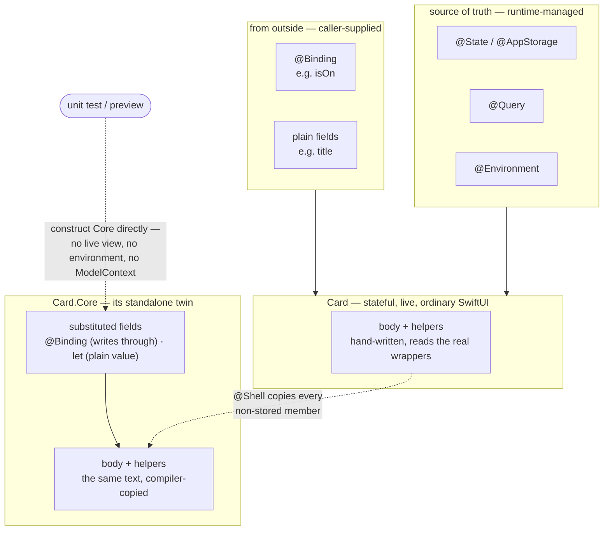
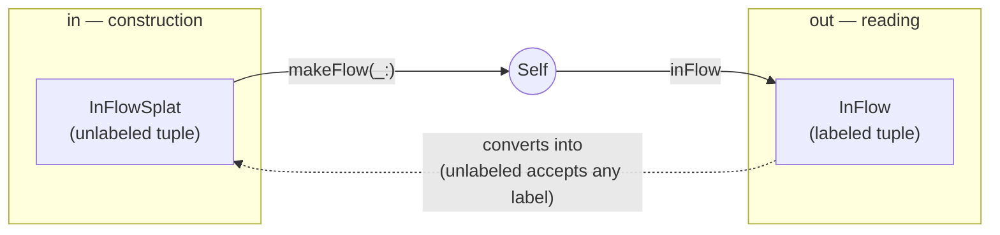
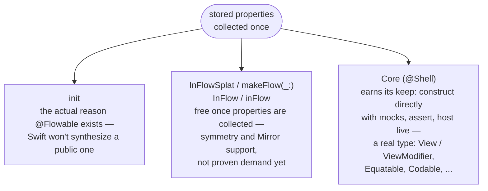

# CoreFlow

A small, growing collection of independent Swift macros, all shipped from one
library — a single dependency gets you every macro below:

```swift
// Package.swift
.package(url: "https://github.com/sisoje/swift-value-flow.git", from: "1.0.0"),

// target dependency
.product(name: "CoreFlow", package: "CoreFlow"),
```

Requires Swift 6.3+ (`swift-tools-version: 6.3`). Builds across the whole swift-syntax
6xx line. Run everything with `swift build && swift test`.

## What's inside

| Macro | Form | Does |
|---|---|---|
| [`@Shell`](#shell) | member | generates a nested, nominal `Core` struct capturing a `View`/`ViewModifier`'s full externally-relevant state — real `Equatable`/`Codable`/protocol conformance a tuple can never have |
| [`@Flowable`](#flowable) | member | writes a memberwise `init` at the type's own access level, plus `InFlowSplat`/`InFlow` typealiases bundling the same properties into a tuple, unlabeled and labeled |
| [`@Capability`](#capability) | member | bundles every eligible computed property/method into a `Capability` tuple + computed property — works on an extension |
| [`#pick`](#pick-tuplepicker) | expression | projects one or more fields — via KeyPath — from one or more sources into a single tuple |
| [`Reflector`](#reflector) | runtime utility (not a macro) | lists a value type's field names off its type alone, no instance needed — pairs with `@Flowable`'s `InFlow` |

---

## Shell

A `member` macro, separate from `@Flowable` — works with or without
`@Flowable` also attached (it collects the
type's stored properties itself). It generates a nested `Core` struct —
always internal, regardless of the attached type's own access level, and
carrying no `@Flowable` — the host's standalone twin: every stored property
the host declares, in exactly two kinds — *mapped* wrappers substituted with a
mockable stand-in (the whitelist in the
[wrapper mapping reference](#wrapper-mapping-reference), the only wrappers
this package really knows), and everything else — *unknown* — copied
verbatim, attribute arguments and default kept, `private` kept, `public`
erased. Plus a
verbatim copy of every non-stored member — `body`, helpers, methods, static
members, nested types. Every field is `var`.
Initializers are the one member kind not copied:
`Core` is constructed through Swift's synthesized memberwise init, and a
copied init would suppress it. Members declared in a separate extension of
the host aren't seen (a macro only receives the attached declaration's own
syntax).

```swift
@Shell
struct Card: View {
    @Query private var items: [Item]
    @State private var isExpanded = false
    let title: String

    var body: some View { ... }   // ordinary SwiftUI, written once

    // generates:
    // struct Core: View {
    //     @QueryCore var items: [Item]
    //     @Binding var isExpanded: Bool
    //     let title: String
    //     var body: some View { ... }   <- the same text, copied
    // }
}

// tests/previews construct the twin directly — no live view, no ModelContext,
// and the @QueryCore field's init parameter is the bare fetched value:
Card.Core(items: [item], isExpanded: .constant(true), title: "t")
```

### Wrapper mapping reference

The transform rules, all three of them. **Rule 1** — no wrapper: copied as
is, `let`/`var` and initial value kept, `public` stripped (a defaulted
`let` is a constant on `Core` too — no memberwise parameter, same as on
the host). **Rule 2** — the mapping whitelist,
the only wrapper kinds this package really knows, all required private:
`@State`/`@AppStorage`/`@SceneStorage` (in a test you mock a `Binding` to
capture every write the copied body makes) plus `@Query`, substituted for
the practical reason that reading a fetched array shouldn't require standing
up an entire SwiftData stack. It's exactly the wrappers where a substitution
buys a real mock, and nothing else qualifies (`@FocusState`'s `.Binding`
projection, say, can't be test-backed — no public initializer — and no-ops
outside a live view, so a stand-in would be a pass-through, not a mock: it's
just an unknown wrapper). **Rule 3** — any other wrapper, `@Binding`
included, is unknown and copied verbatim — that's the last row, and it's not
an error case: `@Binding`, `@Environment`, `@GestureState`, `@Namespace`,
`@ScaledMetric`, `@Bindable`, `@StateObject`, your own custom wrapper, one
SwiftUI hasn't shipped yet — all ride onto `Core` byte-for-byte (attribute
arguments and default value kept, `private` kept, `public` erased) and just
behave there. Private verbatim copies are sealed — no init parameter, no
reads — they just behave.

Types are left out below on purpose: each attribute already implies its own
type (`@Binding` → `Binding<T>`, `@QueryCore` → `QueryCore<T>`, and so on).

The whitelist — the only substitutions the macro makes; everything else
(plain fields, any other wrapper) is copied verbatim:

| Shell | Core |
|---|---|
| `@State` | `@Binding` |
| `@AppStorage` | `@Binding` |
| `@SceneStorage` | `@Binding` |
| `@Query` | `@QueryCore` |

> **`@StateObject` and `@ObservedObject` are deliberately unmapped.** They're
> Combine-era `ObservableObject` wrappers — MVVM-shaped state, exactly what
> this package's plain-data model exists to avoid — so they get no mocking
> stand-in and never will. Like any unknown wrapper they're copied onto
> `Core` verbatim and left alone; if you want testable state, model it with
> the mapped wrappers instead. These are classes: reference-type state
> containers bolted onto a value-type dataflow, opaque to SwiftUI's
> dependency graph and to any snapshot of plain data — they clog the data
> flow. This isn't a fringe position: see the long-running
> [Stop using MVVM for SwiftUI](https://developer.apple.com/forums/thread/699003)
> thread on the Apple Developer Forums,
> [Stop using MVVM with SwiftUI](https://medium.com/@karamage/stop-using-mvvm-with-swiftui-2c46eb2cc8dc)
> (karamage), and
> [SwiftUI Architecture — A Complete Guide to the MV Pattern Approach](https://medium.com/better-programming/swiftui-architecture-a-complete-guide-to-mv-pattern-approach-5f411eaaaf9e)
> (Azam Sharp — "the View is the view model").

### Mocking the bindings

Use-site code, deliberately not generated. A test backs each
`Binding`-typed parameter with whatever fits: `.constant`, a
`Binding(get:set:)` capturing writes into a local, or — for several
bindings at once — a hand-written `@Observable` model whose
`Bindable(model).x` projections mint real write-through bindings in plain
code, no view needed:

```swift
var writes: [Bool] = []
let core = Card.Core(
    items: [item],
    isExpanded: Binding(get: { false }, set: { writes.append($0) }),
    title: "t")
core.isExpanded = true          // body writes land in `writes`
```

(Generating a binding-wiring model class was considered and rejected — the
few lines it would save belong at the use site, shaped by the test.)

One testing gotcha: `@MainActor` is required on any test suite touching a
`View`-conforming type's members — `Core` included. `View` conformance
implicitly infers `@MainActor` isolation for the whole type, so a
nonisolated test function crosses that boundary at runtime and traps under
Swift 6 strict concurrency, even just reading a computed property.

**A few things worth spelling out beyond the table above — the last one is about
`@ViewBuilder`, which isn't a row in it at all (see why above):**

- **`@QueryCore` is a real, one-to-one drop-in for the live `@Query`.**
  Verified directly against the `_SwiftData_SwiftUI` interface: `Query`'s
  instance surface is exactly `wrappedValue`, `fetchError`, and
  `modelContext`, with **no `projectedValue`** — so `QueryCore` carries the
  same three and nothing else. That read-surface match is what lets the
  copied `body` compile on `Core`: the host's body text was written against
  the live wrapper (`items.isEmpty`, `ForEach(items)`), and on `Core` the
  same text still works because `core.items` reads the mock's array
  directly — `_items.fetchError`/`_items.modelContext` spell the same on
  both sides too. Both extra fields
  default (`fetchError` to `nil`, `modelContext` to the environment's own
  default context — safe outside any live view, verified directly, no crash),
  which makes `QueryCore`'s init callable with the wrapped value alone — so
  `Core`'s synthesized memberwise init takes the *bare* fetched value, and a
  test writes `Core(items: [item], title: "t")` with no `QueryCore` spelling
  at all (a directly constructed `Core`'s `fetchError`/`modelContext` take
  `QueryCore`'s defaults).
- **The verbatim row is one uniform rule, not a bag of special cases.**
  Whatever behavior lives in an unmapped wrapper's own attribute arguments —
  a `@GestureState(reset:)` closure, an `@Environment` key path, a
  `@ScaledMetric(relativeTo:)` — rides onto `Core` byte-for-byte with
  nothing to reconstruct, proved live by a UI test (`TrickyDragCardUITests`
  in the ExampleApp: the custom reset closure fires on `Core`'s copy
  exactly as on the host). A private copy is self-initializing (the host compiled
  without an init assigning it), so it drops out of `Core`'s memberwise init
  and produces its value live instead: an `@Environment` copy reads the *real* environment
  reactively when `Core` is hosted (mock it there via `.environment(...)`,
  the wrapper's own native story) and the default `EnvironmentValues`
  outside a live view; a `@GestureState` copy starts a fresh gesture at its
  declared default. Private verbatim fields are sealed.
- **`@ViewBuilder`'s two stored forms get opposite treatment, on purpose.** A
  stored *closure* (`let content: () -> Content`) already has a closure-typed
  field, so mirroring `@ViewBuilder` is pure upside — real builder syntax at
  `Core`'s own init call site. A stored *value* (`let footer:
  Content`) does **not** keep the attribute: mirroring it there would make
  Swift's own synthesized init wrap the parameter in a builder closure purely
  to satisfy the attribute (verified directly) — overhead with no benefit for
  a value that's already built and just being copied through. So `footer`
  stays a plain `let footer: Content`, passed straight through with no
  wrapping needed on either side.

### Why a nominal struct, not a tuple

Tuples can't conform to protocols — verified directly against the real compiler:

```
type '(x: Int, y: String)' cannot conform to 'Equatable'
only concrete types such as structs, enums and classes can conform to protocols
```

So a tuple snapshot can never be `Equatable`, `Codable`, or conform to a shared
"any stateless snapshot" protocol for generic code to work with — and it can't
carry copied members or host live. `Core` is a
real nominal struct capturing the same data, so it can — for free, the moment it's
declared as a real `struct`.

### Why `Core` is always internal, and carries no `@Flowable`

`Core` is a purely internal testing/preview seam — not part of the attached
type's public API, even when that type itself is `public`: consumers of a
public host never need the twin, only the module's own tests do (reachable
from the same module, or a `@testable import`). The struct and every mapped
field are always internal, never mirroring the attached type's access level;
verbatim-copied fields keep `private` if the host declared it (`public` is
erased).

No hand-rolled init is needed either. Swift's own memberwise-init synthesis
already reproduces every field-specific behavior `@Flowable` would generate
by hand — verified directly: a property-wrapper field with no
`init(wrappedValue:)` (`@Binding`) synthesizes a parameter of the *wrapper's*
type, one that does (`@QueryCore`, `@Bindable`) synthesizes a parameter of
the *wrapped* type, and `@ViewBuilder` directly on a stored `let` synthesizes
a real builder parameter for the stored-closure form (see below) — exactly
what `@Flowable` would hand-write. The one thing genuinely lost by skipping
`@Flowable` is
`InFlow`/`InFlowSplat`/`inFlow`/`makeFlow(_:)` on `Core` itself,
accepted since nothing here needs to round-trip a snapshot back into itself.

**The mapped source-of-truth wrappers must be private — enforced with a
diagnostic, not accommodated.** They're a view's own source of truth, never
something a caller supplies (`@Binding` is for that); declaring one
non-private is a compile error, so every renderer downstream can assume the
substituted set is always private, with no "what if it's also public" case
to reason about. Unknown wrappers carry no privacy rule — private or not,
their declaration is copied verbatim, and a non-private one simply stays a
memberwise-init parameter like any other non-private field.

### Notes on the rows

- **`@Binding` lands on the same shape `@State`/`@AppStorage` are substituted
  into** — its rule-3 verbatim copy already *is* `@Binding var name: T`, the
  form the whitelist substitutes those wrappers into, so `Core` treats caller
  bindings and substituted storage identically. The payoff: `snap.name` reads
  the wrapped value directly, no `.wrappedValue` unwrap — and `snap.name =
  newValue` writes straight through to whatever storage the original binding
  pointed at, genuinely two-way.
- **`@ViewBuilder` rides along as init machinery — kept only
  for the stored-*closure* form** (`content: () -> Content`): the field type
  is already a closure there, so the attribute is pure upside — real builder
  syntax at `Core`'s own init call site, not just documentation. For a
  stored *value* (`let footer: Content`), keeping the attribute would make
  Swift's own synthesized init wrap the parameter in a builder closure
  purely to satisfy it (verified directly) — overhead with no benefit for a
  value that's already built and just being copied through — so it's dropped
  there entirely: `footer` stays a plain unattributed field, passed straight
  through in `core` with no wrapping on either side. `@ViewBuilder` is *not*
  a `@propertyWrapper` — it's a result-builder attribute, legal directly on
  stored properties (verified directly, `let` and `var` both).

### Automatic `View`/`ViewModifier` detection

When the attached type's own inheritance clause spells `View` or
`ViewModifier`, `Core` is additionally declared to conform to the same
protocol — satisfied by the copied `body`/`body(content:)`. For
`ViewModifier`, the copied `body(content:)`'s `Content` resolves to `Core`'s
*own* `ViewModifier.Content` — a different concrete type from the host's
(`typealias Content = _ViewModifier_Content<Self>` is keyed on the conforming
type itself, verified directly) — which is fine: each type satisfies the
protocol independently.

**This detection is syntactic, not semantic.** A macro never gets a type
checker, so it can only read the literal inheritance clause written on the
attached declaration itself — conformance added in a separate extension
elsewhere, via a typealias or protocol composition, or spelled with a
qualification (`SwiftUI.View`), is invisible to it. Only a bare `View`/
`ViewModifier` identifier directly on the attached type is recognized.

### How a Core relates to its host

The host is a completely ordinary SwiftUI view — its hand-written `body`
reads caller-supplied values and its own sources of truth directly. `Core` is
the same code with the runtime unplugged:



- **`CardBody -.-> SNBody`** (dotted, generated) — the copy: one source
  text, two types. The live view runs it against the real wrappers; `Core`
  compiles the identical text against the substituted fields. Drift is
  impossible.
- **`Test -.-> Fields`** (dotted) — the payoff: construct a `Core` directly
  with mocks — in a unit test or a preview — and assert on its
  fields, call its helpers, or render its body, no live rendering pipeline
  required.

---

## Flowable

A `member` macro that writes a memberwise `init` for the type it's attached to, **at
the type's own access level**. It fills the initializers Swift won't synthesize: the
`public init` a public struct needs, and *any* init for a `class` or `actor` —
including an `@Observable final class`. Alongside the init, it also declares two
typealias/accessor pairs — an unlabeled `InFlowSplat` with a `makeFlow(_:)`
factory building `Self` back *from* one, and a labeled `InFlow` with an
`inFlow` computed property reading the current instance's data back *out*. See
[below](#the-inflowsplat-typealias), [below that](#the-makeflow_-factory),
[below that](#the-inflow-typealias), and [below that](#the-inflow-property).

See the [diagram below](#how-inflowsplat-and-inflow-relate) for how the whole
shape fits together.

```swift
@Flowable
public struct User {
    public let id: UUID
    public var isActive = false
}
// generates:
// public init(id: UUID, isActive: Bool = false) {
//     self.id = id
//     self.isActive = isActive
// }
// public typealias InFlowSplat = (UUID, Bool)
// public static func makeFlow(_ flow: InFlowSplat) -> Self {
//     Self(id: flow.0, isActive: flow.1)
// }
```

Works the same on a `class` or `actor`:

```swift
@Flowable
@Observable final class Counter {
    var count = 0
}
// init(count: Int = 0) { self.count = count }
// typealias InFlowSplat = Int          // one property → bare type, not a 1-tuple
// static func makeFlow(_ flow: InFlowSplat) -> Self { Self(count: flow) }
```

### What it does

- **Mirrors the access level** — `public struct` → `public init`, an internal type →
  unmodified `init`, and so on.
- **`var` defaults carry through** — `var x: Int = 0` → parameter `x: Int = 0`. An
  optional `var` is implicitly nil-initialized, so `var name: String?` → parameter
  `name: String? = nil`, just like Swift's own memberwise init.
- **Function-typed properties get `@escaping`**, attributed types included
  (`@MainActor () -> Void`, `@Sendable (Int) -> Void`). Optional closures
  (`(() -> Void)?`) pass through as-is — they're already escaping.
- **Skips** computed properties and `static`/`class` members; keeps stored properties
  that have only `willSet`/`didSet` observers.

### SwiftUI

- **`private` properties are excluded** from the init. Since SwiftUI's view-owned
  wrappers — `@State`, `@Environment`, `@StateObject`, … — are always `private`, they
  fall out automatically. No configuration, no per-wrapper list.
- **`@Binding`** is threaded in as a projected `Binding<T>` parameter, assigned to the
  backing storage (`self._x = x`).
- **`@ViewBuilder`** carries onto the parameter so callers get trailing-closure syntax.
  A stored closure (`let content: () -> Content`) becomes `@ViewBuilder content: @escaping () -> Content`;
  a stored value (`let footer: Content`) becomes `@ViewBuilder footer: () -> Content` and the
  init calls it (`self.footer = footer()`).

```swift
@Flowable
struct Card<Content: View>: View {
    @Environment(\.colorScheme) private var scheme   // excluded (private)
    @State private var expanded = false              // excluded (private)
    @Binding var isOn: Bool                           // init param: Binding<Bool>
    let title: String
    @ViewBuilder let footer: Content                  // init param: @ViewBuilder () -> Content

    var body: some View { /* ... */ }
}
// init(isOn: Binding<Bool>, title: String, @ViewBuilder footer: () -> Content)
```

### Design: for pure data

- **No real type inference — except three unambiguous literal kinds.** It's
  syntax-only: a property needing an explicit type must have one, *unless* its
  inline default is a bare `Bool`/`Int`/`String` literal (`var isOn = false`,
  `var count = 0`, `var label = "x"`) — those three are inferred straight off
  the literal's own syntax, no type checker involved. Anything else uninferable
  (a call, an identifier, `nil`, a collection literal, …) still needs an
  explicit annotation.
- **No stored `let` constants.** A constant isn't per-instance data — use `static let`.
  The macro doesn't special-case an instance `let`: `let version = 1` generates
  `self.version = version` (a `let`-reassignment error) — the type gets inferred as
  `Int` just fine (see above), it just doesn't help; either way it won't compile.
- **`private` means private, and it must mean something.** If a value is meant to be
  passed in, it isn't private — `@Binding`/`@ViewBuilder` declared private
  are unreachable by any caller and are rejected outright. And a private property with
  no wrapper at all (`private var cache = 0`) isn't quietly excluded
  anymore either — it's neither a source of truth nor something a caller supplies, so
  pure data flow has no room for it: give it a real wrapper, or make it non-private.

### The InFlowSplat typealias

Alongside the init, `@Flowable` declares `InFlowSplat` — the same properties
bundled into a tuple type, for API uniformity/discoverability (e.g. `Foo.InFlowSplat`
is always there to reference generically) rather than as a second constructor;
nothing in the init routes through it.

```swift
@Flowable
public struct User {
    public let id: UUID
    public let name: String
}
// public typealias InFlowSplat = (UUID, String)

let flow: User.InFlowSplat = (id: someID, name: "Ada")
```

It's built independently of the init, so it diverges from it in a few ways:

- **Unlabeled** — `(UUID, String)`, not `(id: UUID, name: String)` — deliberately,
  so any structurally-compatible tuple converts into it, not just one built with
  these exact field names ("splat" in the name). Verified directly: a tuple
  *value* already bound with different labels (`let t = (xxx: 1, yyy: 2)`) fails
  to convert into a *labeled* tuple type of the same shape (`error: cannot
  convert value of type '(xxx: Int, yyy: Int)' to expected argument type '(x:
  Int, y: Int)'`), but succeeds once the target is unlabeled — Swift only
  enforces label agreement between two *labeled* tuple types. A labeled tuple
  *literal* (`(id: someID, name: "Ada")`, as above) converts into an unlabeled
  target either way, so you can still write field names for your own
  readability when constructing the value — only a pre-existing,
  differently-labeled variable needed the loosening. The real cost: with no
  labels, the compiler no longer catches two same-typed fields passed in the
  wrong order.
- **No per-field defaults.** Tuple element types can't carry `= default` — so an
  inline `var` default, and an optional `var`'s implicit `nil`, are both dropped,
  unlike the init right above it.
- **One property still gets an `InFlowSplat` — just not a tuple.** Swift has no
  1-tuples — `(Int)` as a type collapses to plain `Int` regardless of labels — so
  with exactly one participating property, `InFlowSplat` aliases the bare field
  type directly (`typealias InFlowSplat = Int`).
- **Zero properties → no typealias at all.** There's nothing to alias, and the init
  already covers the zero-property case on its own (`init() {}`).
- **Never `@escaping`**, even on function-typed fields — a closure nested inside a
  tuple type is already escaping; writing the attribute there is a compile error.
- **`@ViewBuilder` is ignored entirely.** A stored-value field
  (`@ViewBuilder let footer: Content`) keeps its own type in the typealias
  (`Content`, not `() -> Content`) and would be assigned directly if anything
  consumed it. The init wraps that field in a builder closure specifically to get
  trailing-closure syntax at the call site; a tuple type has no parameter position
  for that syntax to attach to, so the wrapping would buy nothing here — and would
  actively work against the point of `InFlowSplat`, which is data you pass
  around, store, or diff, not a closure.

### The makeFlow(_:) factory

A `static func makeFlow(_ flow: InFlowSplat) -> Self` that builds an instance from
an `InFlowSplat` value — declared whenever `InFlowSplat` itself is (same
collapse/absence rules). It forwards each field directly:

```swift
let flow: User.InFlowSplat = (id: someID, name: "Ada")
let user = User.makeFlow(flow)

// Any structurally-compatible tuple works, not just one built with these field
// names — InFlowSplat is unlabeled:
let differentlyLabeled = (uuid: someID, label: "Ada")
let user2 = User.makeFlow(differentlyLabeled)
```

- **A static function, not a second `init`** — deliberately, so it works the same on
  a struct, class, or actor. A delegating second `init` (`init(...)`) requires
  the `convenience` keyword on a class/actor and drags in Swift's
  designated/convenience init rules; a plain static function returning `Self(...)`
  sidesteps that entirely.
- **Direct field forwarding**, not a trick. `Self(x: flow.0, y: flow.1)`
  — not `[layout].map(Self.init).first!`, which is what you'd reach for by hand to
  get an *unapplied* `Self.init` reference to accept a tuple positionally (it works,
  but the macro doesn't need it: it already knows every field's position).
- **Fields are read positionally** — `flow.0`, `flow.1`, … in field
  order — since `InFlowSplat` itself is unlabeled.
- **A `@ViewBuilder`-stored value is the one field that isn't forwarded as-is.**
  `InFlowSplat` holds it as a plain value, but the primary init still wants a
  `() -> Content` builder for it — so `makeFlow(_:)` wraps it back into a
  trivial closure: `footer: { flow.2 }`.
- **Positional, unlabeled parameter (`_ flow:`)**, not a labeled `make(inFlowSplatted:)`
  — a deliberate naming choice, so the call site reads `Type.makeFlow(someFlow)`.

### The InFlow typealias

The reverse direction from `InFlowSplat`: the same fields and types, but **labeled**
— `(id: UUID, name: String)`, not `(UUID, String)`. Same collapse/absence rules
(one property → bare type, zero → nothing).

```swift
let named: User.InFlow = (id: someID, name: "Ada")
```

Labeled specifically for readable field access (`named.id`, not `named.0`) and real
reflection support — verified directly: `Mirror(reflecting:)` reports each field's
actual name over a *labeled* tuple, but only positional labels (`.0`, `.1`) over an
*unlabeled* one, so `InFlowSplat` alone can't back a generic field-name utility.
`InFlow` can — see [`Reflector`](#reflector) below.

### The inFlow property

A computed property extracting the *current* instance's values into an
`InFlow` — the reverse of `makeFlow(_:)`. Declared whenever
`InFlow` is.

```swift
let user = User(id: someID, name: "Ada")
user.inFlow   // (id: someID, name: "Ada")

// Round-trips through makeFlow(_:) with no manual conversion — an
// InFlow value converts into InFlowSplat's unlabeled parameter the same
// way any differently-labeled tuple does:
let copy = User.makeFlow(user.inFlow)
```

- Every field reads straight off `self` (`x`) — except `@Binding`, which
  reads its projected form (`$x`) to match `InFlowSplat`'s `Binding<T>` field
  type.
- **No `@ViewBuilder` wrapping needed here**, unlike `makeFlow(_:)`'s reverse
  direction: a stored property already holds exactly its own declared type
  regardless of `@ViewBuilder` — that attribute only ever reshapes the *init
  parameter*, never the property's own storage.

These four members are all `@Flowable` generates beyond the init —
deliberately. A wider snapshot over the private wrapper state is
[`@Shell`'s `Core`](#shell)'s job, as a real nominal struct that can
conform to protocols, host live, and be constructed with mocks — a
generated tuple could do none of that (and a tuple of `$state` bindings
wouldn't even write through outside a live view — verified directly,
`@State` and `@SceneStorage` both; see the
[wrapper mapping reference](#wrapper-mapping-reference)). And there's no
generated field-names member: [`Reflector`](#reflector) already reports any
generated tuple's field names (`Reflector.fieldNames(of:
SomeType.InFlow.self)`) with no dedicated member needed.

### How InFlowSplat and InFlow relate



- **`InFlowSplat`/`makeFlow(_:)`** — data flowing *in*, to build a `Self`.
- **`InFlow`/`inFlow`** — the same fields flowing back *out*, labeled for
  reading — and, since it's structurally the same shape as `InFlowSplat`
  minus labels, it converts right back into `makeFlow(_:)`'s parameter with no
  manual conversion.

**Honest caveat on `InFlow`/`inFlow` specifically:** it's declared mainly
*because the properties are already collected* for the init and `InFlowSplat`
right next to it — free API symmetry, and real `Mirror` support (see
[Reflector](#reflector)) — not because real code has actually needed a
labeled, readable *out* tuple yet. `InFlow` is closer to "it
costs nothing extra to generate, so it's here if you want it." The diagram
below makes that distinction explicit.

**Why tuples, not a dedicated generated struct per type:** a tuple is a
*structural* type — two tuples with the same element types match regardless of
where they came from, with no shared nominal declaration needed. That's
exactly what a data-flow shape wants: `InFlow` and `InFlowSplat` need to
convert into each other, and any external, differently-labeled tuple needs to
splat into `makeFlow(_:)`, without this package generating (and you naming) a
bespoke struct type for every field combination across every `@Flowable`
type. A nominal type would need its own declaration, its own name, and
explicit conversion code between every pair that should interoperate — an
independent named type *per shape*, i.e. type explosion. Tuples sidestep all
of it: the shape itself *is* the type.

### Why each member exists — structure vs. motivation

The diagram above shows how the pieces convert into each other; it doesn't
show *why* each one is there. They don't all have the same reason:



- **`init`** — not optional, not speculative: it's the specific gap `@Flowable`
  fills (Swift only synthesizes an *internal* memberwise init, never a public
  one).
- **`InFlowSplat`/`makeFlow(_:)`/`InFlow`/`inFlow`** — a byproduct of already
  having collected the properties for the init. Cheap to generate, genuinely
  useful *if* you need splat-construction or `Mirror`-based field names — this
  package's own Examples/tests do exercise them (`Point.makeFlow(keke)`,
  `Reflector.fieldNames(of: Point.InFlow.self)`), but only to demonstrate they
  work, not because another feature in this package needed them to. Nothing
  else here depends on `InFlow` existing.
- **`Core`** — [`@Shell`](#shell)'s member, over the same collected
  properties: the one with a demonstrated reason to exist — testability
  without a live view — as a real type where a generated tuple structurally
  couldn't follow (real `View`/`ViewModifier` conformance,
  `Equatable`/`Codable`, generic code needing a shared protocol).

---

## Capability

A `member` macro that bundles every eligible **computed** property and method of the
type — or extension — it's attached to into one `Capability` tuple typealias and a
`capability` computed property: a lightweight "protocol witness"-style bundle of
*behavior*, as opposed to `@Flowable`'s `InFlowSplat` typealias, which bundles
*data*.

```swift
struct Counter {
    private var count = 0
}

@Capability
extension Counter {
    var doubled: Int { count * 2 }
    func increment() { /* ... */ }
    func fetch() async throws -> Int { count }
}
// generates:
// typealias Capability = (doubled: Int, increment: () -> Void, fetch: () async throws -> Int)
// var capability: Capability {
//     (doubled, increment, fetch)
// }
```

### Works on an extension — unlike @Flowable, on purpose

`@Flowable` collects **stored** properties, and extensions can never declare
those — so there's nothing for it to find if attached to one; that's a hard Swift
rule, not a missing feature. `@Capability` collects **computed** members instead,
which extensions declare just as freely as a primary type body, so it works equally
well attached directly to a struct/class/actor or to an extension of one.

### What's collected

- **Computed properties** (`var x: Int { ... }`) — needs an explicit type
  annotation, same syntax-only reasoning as the other macros. Stored properties
  (including ones with only `willSet`/`didSet`) don't participate.
- **Instance methods** — turned into a closure type from the parameter types
  (labels dropped, matching how closure types work), `async`/`throws` effects, and
  return type (`Void` if omitted).
- **Skipped**: `private`/`fileprivate`, `static`/`class`, initializers, subscripts,
  and `mutating` methods — Swift can't form a plain closure reference to a mutating
  method on a value type, so including one would generate code that doesn't
  compile.

One eligible member collapses `Capability` to that member's bare type/value — same
1-tuple collapse `@Flowable`'s `InFlowSplat` typealias does, for the same reason
(Swift has no 1-tuples). Zero eligible members is a diagnostic, not an empty
`Capability`.

### No `@Sendable`

The generated closure fields are deliberately **not** marked `@Sendable`. Verified
directly, both ways: marking them unconditionally makes the generated code fail to
compile for any type that captures something non-Sendable (a plain class reference,
say) — `error: converting non-Sendable function value to '@Sendable () -> Void' may
introduce data races`. Omitting it compiles cleanly regardless, and still permits
genuine cross-`Task`/actor usage in practice: Swift 6's region-based Sendable
checking runs at the point the tuple literal is actually built (inside the
generated `capability` getter), independent of whether the field's declared type
says `@Sendable`.

---

## #pick (TuplePicker)

One macro, one shape: `#pick(from: value, \.a, \.b)`. One, two, or three sources —
arity-generic overloads of the exact same syntax, resolved by the compiler like any
other overloaded function, sharing one implementation.

### The idea

```swift
typealias Store = (expenses: [Int], limit: Int, name: String)
typealias Actions = (alerts: [String], submit: () -> Void)

let store: Store = (expenses: [12, 40, 7], limit: 100, name: "Groceries")
let actions: Actions = (alerts: ["low battery"], submit: {})

let picked = #pick(from: store, \.name, \.limit => "total")
// → (name: store.name, total: store.limit) — one source, renamed and reordered

let merged = #pick(from: store, \.expenses, \.limit, from: actions, \.alerts)
// → (expenses:, limit:, alerts:) — two sources, one tuple
```

Single key path returns the bare value (Swift has no 1-tuples); several return a labeled
tuple in exactly the order you wrote them. `=>` renames a field's output label without
giving up KeyPath typing or implicit-root inference. Works on structs, classes, and bare
tuple values — see below for why that last one wasn't a given. A second (or third) source
is just another `from:` group in the same call.

Every source starts with a real `from:` label — there's exactly one shape for `#pick`,
whether it's one source or three, dispatched to the right arity-generic overload by
Swift's own overload resolution (argument count), backed by a single implementation
(`PickMacro`).

### Run it

- `swift test` — macro-expansion + diagnostic tests (`assertMacroExpansion`) and an
  end-to-end suite that compiles and runs real `#pick` calls, across arities.
- Open `Package.swift` in Xcode, right-click a `#pick` call → **Expand Macro** to see the
  full emission inline.

### Honest limitations (each one was hit, argued, and verified against the real compiler)

#### `#pick`'s labels are cosmetic, not static

Every arity's declared signature returns a parameter pack (one source: `(repeat each
V1)`; two sources: `(repeat each V1, repeat each V2)`, one pack per source concatenated;
and so on), and parameter packs can't carry per-element labels in today's Swift. The
expansion body *does* build a labeled tuple literal (visible via "Expand Macro"), but at
the call site the value's static type is the unlabeled pack expansion, so labels get
silently stripped on assignment. Access the result by index (`.0`, `.1`), not by field
name — see `EndToEndTests.pickSingleFieldReturnsBareValue`.

#### Rename via a real argument label — a hard wall for one field, verified twice; fine for a whole source

The natural way to write a single-field rename would be
`#pick(from: store, \.expenses, total: \.limit)` — a real Swift argument label attached
to *one element* inside the picks. **This cannot work, full stop, no matter how `#pick`
is declared.** Verified two ways: first as a plain generic function with a loosely-typed
`Any...` tail, then directly against the real compiled `#pick` macro:

```
error: extra argument 'total' in macro expansion
    let __labelProbe = #pick(from: store, \.expenses, total: \.limit)
                                                        ^
```

Argument-label matching happens against the callee's *declared parameter list* — and a
variadic/pack parameter is one parameter, however many arguments it expands to. There is
no way to declare a parameter that accepts an arbitrary caller-chosen label attached to
one of its elements; loosening the type doesn't help, because the problem isn't type, it's
that `total:` doesn't match any declared parameter name at all.

The fix that ships for renaming *a field*: a custom operator. `\.limit => "total"` is a
*real* expression — the operator returns the same `KeyPath` type as its left operand — so
it type-checks against `repeat KeyPath<T, each V>` with full inference (implicit-root
`\.limit` keeps working). No loosened or untyped fallback needed; `#pick` never evaluates
`=>` at runtime, only reads its syntax to recover the label.

Two more walls along the way, both verified directly:

- The first operator spelling tried, `~>`, is **already declared by the Swift standard
  library itself** (unconditionally in scope everywhere). Redeclaring it collides:
  `error: ambiguous operator declarations found for operator`. `=>` was checked against
  the SDK's declared operators before shipping — collision-free.
- `\.i => .o` — using dot-shorthand instead of a string for the *rename target* — doesn't
  work for the same reason `#pick(from: p1, .x, .y)` (dot-shorthand instead of `\.x` for
  the *picked field*) doesn't: implicit-member syntax (`.foo`) only resolves against a
  real, predeclared member of the expected type. Even a static `@dynamicMemberLookup`
  subscript — the usual trick for open-ended `.anything` syntax — doesn't help; it still
  requires the compiler to accept the specific name, and rename targets are arbitrary.
  There's no Swift mechanism for an unregistered arbitrary identifier without a string.

Note the distinction from `from:` itself, below — that one is not an arbitrary
caller-chosen label attached to one pack element; it's a real, predeclared parameter name
marking the boundary *between* two separate pack parameters. Different mechanism, which is
exactly why it works where `total:` doesn't.

#### `#pick` uses a real, repeated `from:` label to mark source boundaries — verified, not assumed

Given the wall above, it would be reasonable to assume the labeled multi-source form
(`#pick(from: store, \.expenses, \.limit, from: actions, \.alerts)`) hits the same
"extra argument" error — which would force uglier alternatives like nested parens per
source. It doesn't, and the reason is specific: `from:` isn't an
arbitrary caller-chosen label inside one pack parameter (that's the impossible case) —
it's a *real, predeclared* parameter label that repeats once per source in the signature,
marking the boundary *between two separate* pack parameters:

```swift
func pick<T1, each V1, T2, each V2>(
    from a: T1, _ paths1: repeat KeyPath<T1, each V1>,
    from b: T2, _ paths2: repeat KeyPath<T2, each V2>
) -> (repeat each V1, repeat each V2) {
    (repeat a[keyPath: each paths1], repeat b[keyPath: each paths2])
}
```

Verified as a plain function first, including running it (not just type-checking) to
confirm the picks actually land in the right group — `pick(from: store, \.expenses,
\.limit, from: actions, \.alerts)` correctly split into `paths1 = [\.expenses, \.limit]`
and `paths2 = [\.alerts]`. Then verified as an actual macro declaration. One
implementation (`PickMacro`) reads the flat `from:`-labeled argument list for every
arity — one syntax, not two or three.

#### Tuple KeyPaths actually work — a widely-assumed limitation that's stale

Key paths into tuple elements have a long, widely known history of being "not
implemented" in Swift (a 2018 pitch; the identity-keypath half shipped as SE-0227, the
tuple half never did) — an assumption that would force workarounds like mirror
structs bridging picks onto tuple values. No workaround is needed.

Verified directly against a modern toolchain, with real execution:

```swift
let t = (a: 1, b: "x")
let kp = \(a: Int, b: String).a       // → WritableKeyPath<(a: Int, b: String), Int>
t[keyPath: kp]                        // → 1, correct
```

Implicit root, explicit root, heterogeneous field types, positional tuples, and the `=>`
rename operator all work on tuple values with **zero changes** to `#pick`'s declaration.
If you're targeting an older toolchain, verify this specific claim before relying on it.

#### `#pick` can't nest inside a call resolving to the *same declared overload* — but nesting across different arities works, and that distinction was verified, not assumed

`#pick(from: #pick(from: t, \.a, \.b), \.a)` where both calls resolve to the one-source
overload — does not compile: `error: recursive expansion of macro 'pick(from:_:)'`.

The outer macro expands first and, as you'd expect for macro composition in general,
treats the inner call as opaque tokens, copying it verbatim into its own body. That's
where composition would stop cleanly if the two calls resolved to different overloads.
Here they don't: the compiler walks the outer's freshly-produced body for more macros to
expand with "currently expanding `pick(from:_:)`" still on the stack, finds the inner call
resolving to that exact same overload, and refuses.

The working form for same-overload nesting is two separate statements — different
expansion sites, no shared stack:

```swift
let inner = #pick(from: store, \.expenses, \.limit)
let outer = #pick(from: inner, \.0)
```

— which is what `EndToEndTests.pickOfPickComposesOnATupleValue` exercises.

**Nesting a call that resolves to a *different arity's* overload is a different story, and
it works** — verified directly, including at runtime, not just type-checked:

```swift
let nested = #pick(from: #pick(from: store, \.expenses, \.limit), \.1 => "total", from: actions, \.alerts)
```

Here the inner call resolves to the one-source overload (`pick(from:_:)`) and the outer to
the two-source one (`pick(from:_:from:_:)`) — genuinely surprising, since both overloads
are backed by the exact same implementation type (`PickMacro`) after the multi-arity
unification. It would be reasonable to assume the recursion guard is keyed on *that*
implementation-type identity and refuses any nesting once two overloads share one — that
assumption was checked directly and is wrong. Probed empirically both ways: the two-arity
nesting above compiled *and* ran correctly (`(100, ["low battery"])`, matching
`store.limit` renamed and `actions.alerts`), while the same-arity nesting one section up
failed with the exact "recursive expansion" error, on this same shared-implementation
setup. So the guard's actual key is the resolved **declared overload** (its full compiler
signature, e.g. `pick(from:_:)` vs. `pick(from:_:from:_:)`) — not the spelled macro name
(confirmed earlier, before unification, by aliasing two different implementation types
under one name and nesting between them), and not the backing implementation type either
(confirmed now, by unifying two overloads onto one implementation type and finding nesting
between them still works). This composition isn't in the examples, though — writing a
one-source pick as one source's value inside a multi-source call is real but contrived;
nobody reaches for it by default, so it stays here as a documented fact, not a headline
example.

#### Multi-source `#pick`'s pack-of-packs typing — spiked before writing the macro, not assumed

The two- and three-source overloads need a return type that concatenates one parameter
pack per source — `(repeat each V1, repeat each V2)` for two sources. Verified as a plain
(non-macro) generic function first, including a call site to confirm real type inference,
not just that the declaration parses (same function shown above, under "uses a real,
repeated `from:` label").

It typechecked, both declaration and call site — Swift accepts multiple independent
pack expansions concatenated in one tuple type. A fourth source has no matching overload
and falls back to a plain "no matching function" diagnostic; not currently worth a fourth
typed overload for one more source.

#### One shape, no "which mode am I" detection to get wrong

An earlier version of this package had a single macro implementation detect "grouped"
calls by inspecting whether the first argument was a parenthesized tuple. That had a real,
documented sharp edge: detection read *only* argument 0, so a call whose first source
happened to have no picks yet misread as flat and produced a confusing error pointing at
the wrong argument. The current design has no shape to guess at all: every arity reads the
identical flat, `from:`-labeled argument list, dispatched to the right overload by Swift's
own overload resolution (argument count) before `PickMacro`'s expansion function ever
runs. `PickMacro` never asks "which mode is this" — its diagnostics (missing leading
`from:`, a source with no picks, a non-key-path token) all read the same flat list the
same way regardless of how many sources are present.

### Next steps if you keep going

1. **Evolution revival post**: "Tuple element KeyPaths" — worth confirming what shipped,
   where, and since when, on toolchains older than the one this was verified against.
2. **Labeled parameter packs**: if Swift ever supports per-element labels on `repeat each V`,
   every arity could return a genuinely labeled tuple instead of a positional one.
3. **Same-overload nesting, if it ever matters**: `#pick(from: #pick(from: ...), ...)`
   where both resolve to the exact same arity — a distinct declared overload (reachable via
   a hidden internal alias, say) would dodge the recursion guard the same way nesting
   across different arities already does, since the guard is keyed on declared-overload
   identity, not implementation type. Not shipped; two-statement composition covers the
   real need today.

---

## Reflector

Not a macro — a small runtime utility (`Sources/CoreFlow/Reflector.swift`) shipped
alongside the macros because it's a natural companion to `@Flowable`, not because
it needs code generation.

```swift
Reflector.fieldNames(of: User.InFlow.self)   // ["id", "name"]
```

One static function: `fieldNames<T>(of: T.Type) -> [String]`. It needs only the
*type* — no instance — so it can name an `InFlow`'s fields without ever
constructing one.

### How it works

It allocates one **uninitialized** `T` and reads its field labels via `Mirror`:

```swift
static func fieldNames<T>(of: T.Type) -> [String] {
    precondition(!(T.self is AnyClass), "fieldNames requires a value type, got class \(T.self)")
    let p = UnsafeMutablePointer<T>.allocate(capacity: 1)
    defer { p.deallocate() }
    return Mirror(reflecting: p.pointee).children.compactMap(\.label)
}
```

This is safe *specifically* because it only ever reads `.label`, never `.value`.
`Mirror`'s labels come from `T`'s compile-time field-descriptor metadata; a child's
actual value is only lazily materialized (and ARC-retained, for a class-typed field)
if something accesses `.value` — which this function never does.

### Requires a value type — checked at runtime, not compile time

Swift has no generic constraint for "not a class," and a marker-protocol workaround
wouldn't help either, since tuples can't conform to a protocol to opt in — so this is
a `precondition`, not something the type system can catch. Verified directly that
SwiftUI has the identical gap: a `final class` conforms to `View` and compiles fine;
"views are structs" is convention, not compiler-enforced.

The crash this guards against is about **`T`'s own top-level kind, not its fields** —
verified directly, both ways:

- A bare class as `T` (`Reflector.fieldNames(of: SomeClass.self)`) crashes with a
  null-pointer trap: `Mirror` has to cast the top-level value to `CustomReflectable`
  before looking at any field, and uninitialized memory read as a class reference
  fails that cast.
- A **struct** containing a class-typed (or closure, or array) field is fine — same
  uninitialized-memory read, but `Mirror` never needs to validate or retain that
  child just to report its label.

### Pairs with @Flowable

Point it at `InFlow`, not `InFlowSplat`:

```swift
@Flowable
struct Point {
    var x: Int
    var y: Int
}

Reflector.fieldNames(of: Point.InFlow.self)          // ["x", "y"]
Reflector.fieldNames(of: Point.InFlowSplat.self)  // [".0", ".1"] — InFlowSplat is unlabeled
```

`InFlowSplat` isn't wrong to reflect on — it just has no real labels to report, since
it's deliberately unlabeled (see [above](#the-inflowsplat-typealias)). `InFlow`
is the one built for this.

---

## Deliberately no protocol naming the shape

There is no `FlowableRepresentable` protocol (`associatedtype InFlowSplat`,
`static func makeFlow(_:) -> Self`, `var inFlow: InFlow { get }`) for
writing generic code against "any `@Flowable` type" by constraint. Decided
against: without real generic-code use cases, such a protocol's only value
is naming a shape `@Flowable` already generates concretely on every type
it's attached to.

---

## Package layout

One target pair for every macro — not one pair per macro:

| Target | Kind | Contents |
|---|---|---|
| `CoreFlowMacros` | macro plugin | every macro's implementation: `FlowableMacro`, `ShellMacro`, `CapabilityMacro`, `PickMacro`, one file each — plus shared stored-property collection (`StoredProperty.swift`) and rendering (`FlowableRendering.swift`, covering the init and `InFlowSplat`/`InFlow`) that `@Flowable` builds on and `@Shell` reuses (`ShellRendering.swift`), and TuplePicker's own key-path parsing (`KeyPathPick.swift`, `TuplePickerSupport.swift`) |
| `CoreFlow` | library (the one product) | every macro's public declaration — `Flowable.swift`, `Shell.swift`, `Capability.swift`, `TuplePicker.swift` — plus two small non-macro additions: `Reflector.swift` and `QueryCore.swift` |
| `CoreFlowTests` | test (XCTest + swift-testing) | `assertMacroExpansion` coverage per macro, plus TuplePicker's and Reflector's real-compiled end-to-end suites — both test frameworks coexist fine in one target |
| `Examples` | executable | one playground exercising every macro in the package, plus Reflector |

Swift tools version 6.3, Swift 6 language mode (strict concurrency), swift-syntax `600.0.0..<700.0.0`.
