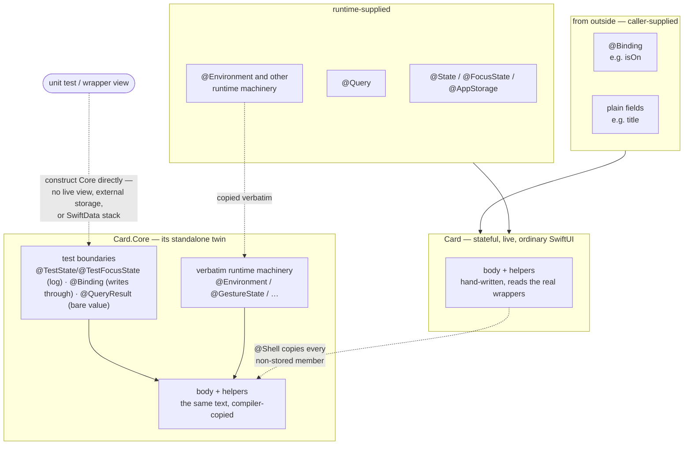
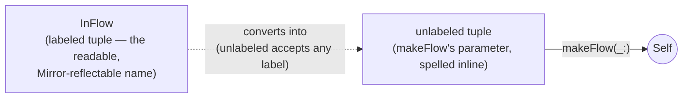
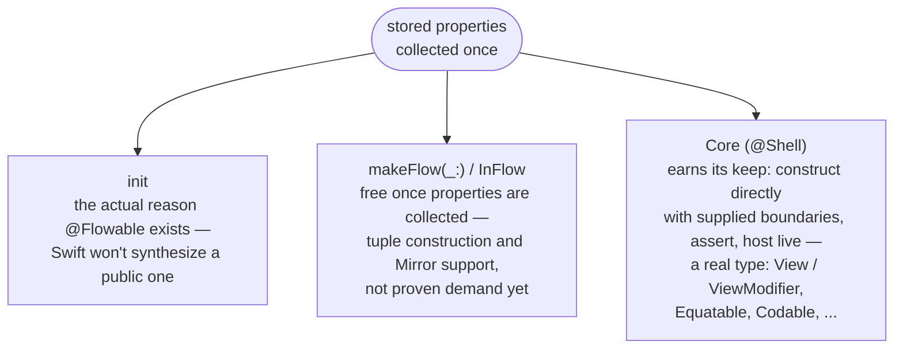

# CoreFlow

[](https://github.com/sisoje/swift-core-flow/actions/workflows/ci.yml)

> **Make any SwiftUI project testable. One line, one macro is all you need.**
>
> **Need a deeplinking system? Also one line, one macro — done.**
>
> **Dynamic SwiftData queries? One view — and mocking them is one line too.**

## Why

Ask how to test a SwiftUI view and the standard answer is: move its logic into
a ViewModel. But a SwiftUI view is not UI. Its `body` never draws anything; it
computes a description from data, including the actions attached to it. Moving
this computation into a ViewModel does not separate logic from UI — it
separates logic from logic, imposing an architecture to compensate for a
tooling gap.

A SwiftUI view is difficult to test because of the runtime around it, not
because of how it is written. `@State` needs a render host, `body`
will not evaluate outside one, and property-wrapper behavior cannot be
abstracted behind a protocol. Tests cannot run the view's logic directly,
substitute the dependencies it reads, or reuse its `body` through a conformance.

## The answer

CoreFlow takes the opposite route: instead of making you restructure your code
to fit the tests, it makes the tests reach the code where you wrote it. SwiftUI
cannot run that code in isolation, so CoreFlow generates a runnable twin. Keep
the production view exactly as it is; the twin is the seam.

State reaches SwiftUI through a source-of-truth declaration on exactly one
node: a view, view modifier, `App`, or `Scene`. Values and bindings carry it to
descendants, forming the dataflow network. CoreFlow attaches its seams at those
declarations: the twin logs writes to node-owned state and turns external
storage and fetched data into test boundaries.

This decides who the package is for. Plain SwiftUI is already in this shape, so
you can adopt CoreFlow one view at a time, with no migration. Put a screen's
state in an `ObservableObject` ViewModel, however, and there is no node boundary
to substitute: the source of truth and its write sites live outside the
network, so the twin inherits the same opaque reference instead of an
observable boundary.

CoreFlow is a small, growing collection of independent Swift macros, all
shipped from one library. A single dependency gets you every macro below.

## Installation

```swift
// Package.swift
.package(url: "https://github.com/sisoje/swift-core-flow.git", from: "1.0.0"),

// target dependency
.product(name: "CoreFlow", package: "swift-core-flow"),
```

Requires Swift 6.4+ (`swift-tools-version: 6.4`, Xcode 27). Builds across the whole swift-syntax
6xx line. Run everything with `swift build && swift test`.

Why 6.4: `@TestState` is an init-accessor property (the same shape the iOS 27
SDK's own `@State` macro expands to). Swift 6.3 makes a struct's memberwise
initializer *private* when a private init-accessor property is present, so
every `@Shell` `Core` — and any view holding `@TestState` — becomes
unconstructible from tests; Swift 6.4 excludes such properties and keeps the
initializer internal. Verified on Xcode 26.6:
`'StatefulCard.Core' initializer is inaccessible due to 'private' protection level`.

The conceptual model — nodes coupled by data, flow at creation, testing as
reading the execution log — is one article:
[SwiftUI Data Flow Masterclass](https://medium.com/@redhotbits/swiftui-data-flow-masterclass-099f0768f776), published on Medium and
taught macro-free; the macros mechanize its shell/core split. This README
is the per-macro reference.

## What's inside

| Concept | Form | Does |
|---|---|---|
| [`@FlowUp`](#flowup) | accessor + peer macro | declares an upward closure flow on `EnvironmentValues` — `.onFlow(\.name)` registers listeners up a preference channel, `.collectFlow(\.name)` spools them back down the environment as one combined closure, `@Environment(\.name)` calls them all |
| [`@Shell`](#shell) | member macro | generates a nested `Core` struct — the host's standalone twin: same body, owned writes logged and external boundaries supplied, directly constructible in tests (previews reach it through a hand-written wrapper view — `#Preview`'s own expansion can't name macro-generated code) |
| [`@Flowable`](#flowable) | member macro | writes a memberwise `init` at the type's own access level, plus a `makeFlow(_:)` factory taking the same properties as one unlabeled tuple and an `InFlow` typealias naming their labeled shape |
| [`@TestState`](#teststate-and-testaction) | accessor + peer macro | a drop-in `@State` that logs every mutation — each write reaches the injected sink the moment it happens, binding writes included |
| [`@TestAction`](#teststate-and-testaction) | accessor + peer macro | an action closure that logs every call — reading the property IS the logged action; each call logs its payload to the injected sink, then forwards |
| [`@TestFocusState`](#testfocusstate) | accessor + peer macro | a drop-in `@FocusState` that logs every programmatic write — a real `FocusState` underneath, so focus genuinely moves when hosted; `$name` is the real `FocusState<T>.Binding` |
| [`@UnstructuredTask`](#unstructuredtask) | accessor + peer macro | a view-owned slot for a cancellable unstructured `Task` — replacing cancels the previous task, view teardown cancels the live one, and every mutation logs like `@TestState` |
| [`@QueryResult`](#queryresult) | property wrapper | `@Query`'s drop-in stand-in on `Core` — the fetched result as a bare init parameter (`Core(items: [item], …)`), same read surface as the live wrapper, no SwiftData stack |
| [`View.mockQuery(_:)`](#queryview) | View modifier | cans a subtree's queries in one line — typed `QueryResult` values per result type; anything unregistered gets the empty result of its shape |
| [`QueryView`](#queryview) | View | the live SwiftData shell — builds a real `Query` dynamically, rebuilt only when its `index` changes, and hands content a `QueryResult` (`{ $books in … }`), so components read plain data in production and tests alike |
| [`SectionedResults.mock`](#sectionedresultsmock--because-apple-sealed-plain-data) | runtime utility | fabricates iOS 27's init-less sectioned results for tests/previews — Apple sealed plain data (filed as FB24480699); genuine inner fetch collection, caller's order, loud failure if the private layout ever changes |
| [`@TestLog`](#the-testlog-seam) | property wrapper | reads the installed sink — `@TestLog private var log` self-initializes and `log(name, value)` is a direct call (verified); the macros generate the same thing as an explicit field, `private let log_x = TestLog()` |
| [`View.testLog(_:)`](#the-testlog-seam) | View modifier | installs the one logging sink, once, on the root view; without it the log is a no-op, so hosts behave normally anywhere else |
| [`@Capability`](#capability) | member macro | bundles every eligible computed property/method into a `Capability` tuple + computed property — works on an extension |
| [`#pick`](#pick-tuplepicker) | expression macro | projects one or more fields — via KeyPath — from one or more sources into a single tuple |
| [`Reflector`](#reflector) | runtime utility | lists a value type's field names off its type alone, no instance needed — pairs with `@Flowable`'s `InFlow` |

---

## Shell

The names are the pattern: **functional core, imperative shell** (Bernhardt,
Wlaschin, Seemann — see [References](#references)). The host is the shell: its
wrappers connect the node to runtime I/O. The generated `Core` is the functional
core — a runnable twin: the same logic, with owned state logging writes,
external storage supplied through bindings, fetched data supplied as values,
and effects supplied as closures — directly constructible and assertable
anywhere. Replacing external sources with test-supplied data removes their live
event channels too: persistence changes and fetch notifications cannot trigger
a wave mid-test. UI-runtime machinery with no suppliable data boundary —
gestures and view identity — rides onto `Core` unchanged (see the
[wrapper mapping reference](#wrapper-mapping-reference)).

Concretely, `@Shell` is a `member` macro that generates a nested,
always-internal `Core`, regardless of the host's access level. Stored properties
follow two rules: wrappers on the mapping whitelist are substituted with test
boundaries, while every other declaration is copied verbatim. The macro also
copies every non-stored member written on the host — `body`, helpers, methods,
static members, and nested types. Initializers are the sole exception: copying
one would suppress the synthesized memberwise initializer that tests use to
construct `Core`. Members in a separate extension remain invisible because the
macro sees only the attached declaration's syntax.

```swift
@Shell
struct Card: View {
    @Query private var items: [Item]
    @State private var isExpanded = false
    @AppStorage("isFavorite") private var isFavorite = false
    let title: String
    let action: (Item) -> Void

    var body: some View { ... }   // ordinary SwiftUI, written once

    // generates:
    // struct Core: View {
    //     @QueryResult var items: [Item]
    //     @TestState private var isExpanded = false
    //     @Binding var isFavorite: Bool
    //     let title: String
    //     let action: (Item) -> Void
    //     var body: some View { ... }   <- the same text, copied
    // }
}

// #Preview can't name macro-generated code like Core — hence the wrapper;
// its construction is also a unit test's entire setup:
struct CardScenario: View {
    @TestState private var isFavorite = false   // every write logs its value
    @TestAction private var action: (Item) -> Void = { _ in }   // every call logs its payload

    var body: some View {
        Card.Core(items: [], isFavorite: $isFavorite, title: "t", action: action)
    }
}

#Preview { CardScenario() }
```

Three terms keep fixed meanings throughout: the **host** (`Card`) is the
production shell; **`Core`** is its generated twin; a **scenario**
(`CardScenario`) is the hand-written stage supplying `Core`'s test boundaries
for a preview or UI test. **A UI test driving a scenario is not an end-to-end
test wearing a costume: it tests the actual unit — `Core` — by evidence, with
no side effects beyond the component's boundaries.** Inside those boundaries, taps,
focus, gestures, and owned state are real; at them, every boundary event —
instrumented state writes and action calls — enters the log instead of crossing
into an effect. The example app follows this model: its `SCENARIO` launch
variable selects the scenario, and XCUITest asserts the log.

### Wrapper mapping reference

Two rules govern the host's stored properties: wrappers on the mapping
whitelist are substituted on `Core`; everything else is copied verbatim.

**Substituted.** Every mapped wrapper is required to be private on the host.
`@State` is node-owned state, so the twin carries it as
[`@TestState`](#teststate-and-testaction) on the same declaration: it remains
private and sealed out of the memberwise initializer, keeps its inline default,
and logs every write. The default is required; a missing one is diagnosed
rather than invented. Moving that state up merely to observe it would falsify
the component's data flow, so the write site emits evidence instead.
`@AppStorage` and `@SceneStorage` are external storage, so they become
`@Binding`: persistence keys disappear because a twin does not persist, while
the scenario supplies the backing and captures writes. `@Query` becomes
`@QueryResult`, making the fetched result a bare input — reading an array should
not require standing up an entire SwiftData stack. `@FocusState` becomes
[`@TestFocusState`](#testfocusstate), a live instrument rather than a mock:
`FocusState<T>.Binding` has no public initializer, and focus writes no-op
outside a live view, so no mock is possible; the substitute retains a real
`FocusState` and logs programmatic writes. `@AccessibilityFocusState` has no
substitute and therefore follows the verbatim rule. The whitelist ends there —
the only wrappers this package really knows: each substitution buys a log, an
injectable boundary, or a bare value.

**Copied verbatim.** Everything else, wrapper or not, keeps the host's
declaration as written. A plain field retains its `let`/`var` and default; a
defaulted `let` remains a constant on `Core` and stays out of the memberwise
initializer. A plain private field is a compile error because pure data flow
has no room for opaque state.

An unmapped wrapper — `@Binding`, `@Environment`, `@GestureState`, `@Namespace`,
`@ScaledMetric`, `@Bindable`, `@StateObject`, a custom wrapper, even an
unrecognized qualified spelling such as `@MyModule.Tracked` — rides onto `Core`
byte-for-byte, including attribute arguments and defaults. That verbatim copy
is load-bearing: reconstructing `@GestureState(reset:)` could silently replace
its custom reset closure, while the copy cannot. `TrickyDragCardUITests` proves
this live — the custom reset fires on `Core` exactly as on the host.

Access follows the source declaration: `public` is erased because `Core` is
internal; `private` stays. A private copy self-initializes — guaranteed because
the host compiled without an initializer assigning it — and remains sealed out
of the synthesized memberwise initializer and caller access, but its behavior
stays live when hosted. `@Environment` reads the real environment reactively —
mock it when hosting via `.environment(...)`, the wrapper's own story — while
`@GestureState` starts each gesture at its declared default. Outside a live
host, they produce their native defaults.

For UI-runtime machinery, no suppliable data boundary exists. A
caller can pass stored data or a fetched result into `Core`, but a live gesture,
namespace identity, display metric, or ambient environment read belongs to the
runtime. That machinery therefore stays verbatim on `Core`: live when hosted,
inert or defaulted otherwise.

| Host | Core |
|---|---|
| `@State` | `@TestState` |
| `@FocusState` | `@TestFocusState` |
| `@AppStorage` / `@SceneStorage` | `@Binding` |
| `@Query` | `@QueryResult` |

> **`@StateObject` and `@ObservedObject` are deliberately unmapped.** They are
> Combine-era `ObservableObject` wrappers — ViewModel-shaped state, the pattern
> this package exists to avoid: when such an object owns screen state and
> actions, the source of truth moves behind a shared mutable reference.
> CoreFlow has no value-shaped boundary to substitute — no bare input, backing
> binding, or write site it can instrument — and any alias can mutate the
> object around `Core`'s boundary. The wrappers therefore ride onto `Core`
> verbatim and will not receive a stand-in. If state must be observable on the
> twin, model it with the mapped wrappers instead. See the anti-MVVM entries in
> [References](#references) for the full argument.

### Mocking the bindings

`Core` treats genuine host `@Binding` properties and
`@AppStorage`/`@SceneStorage` substitutions alike: the caller supplies a
`Binding`. CoreFlow deliberately generates no backing model because that
use-site code is situational and shaped by the test. Use `.constant` for a
read-only value, `Binding(get:set:)` to capture writes in a local, or a
hand-written, file-scoped `@Observable @MainActor` model (`@Observable` cannot
attach to a local type); `Bindable(model).x` mints a real write-through binding
in plain code, with no view required:

```swift
var writes: [Bool] = []
let core = Toggler.Core(          // the host declares `@Binding var isOn: Bool`
    isOn: Binding(get: { false }, set: { writes.append($0) }))
core.isOn = true                  // the copied body's writes land the same way
```

`@State` substitutions need no backing: `Core` owns their storage and logs every
mutation.

One testing gotcha: `@MainActor` is required on any test suite touching a
`View`-conforming type's members — `Core` included. `View` conformance
implicitly infers `@MainActor` isolation for the whole type, so a
nonisolated test function crosses that boundary at runtime and traps under
Swift 6 strict concurrency, even just reading a computed property.

### QueryResult

`@QueryResult` is a one-to-one stand-in for the live `@Query` read surface.
Verified directly against the `_SwiftData_SwiftUI` interface, `Query`
exposes exactly `wrappedValue`, `fetchError`, and `modelContext`, with
**no `projectedValue`**. `QueryResult` carries the same three public members,
plus one deliberate superset the live wrapper lacks: a projection of `self`,
so an SE-0293 `$` closure parameter can re-propertify a passed-in value —
`{ $books in ForEach(books) … }` — with `@Query` ergonomics.

That parity lets the copied `body` compile unchanged: `items.isEmpty` and
`ForEach(items)` still read the supplied array directly, while
`_items.fetchError` has the same spelling on both types. `modelContext`
remains environment-fed — like the live wrapper's — through a private
`@Environment` field; because `QueryResult` is a `DynamicProperty`, it installs
when `Core` is hosted and uses SwiftUI's native mocking path —
`.modelContainer` or `.environment`. It is never read unhosted.

`fetchError` defaults to `nil`, so `QueryResult` can be initialized with
`wrappedValue` alone. That makes `Core`'s synthesized memberwise initializer
accept the bare fetched value: a test writes
`Core(items: [item], title: "t")`, with no `QueryResult` spelling.

### Why a nominal struct, not a tuple

`Core` must be nominal because tuples cannot conform to protocols — verified
directly against the compiler. The block preserves the two message texts while
omitting source locations, severity markers, and the diagnostic identifier:

```
type '(x: Int, y: String)' cannot conform to 'Equatable'
only concrete types such as structs, enums and classes can conform to protocols
```

A tuple could hold the same fields, but it could not conform to `View`,
`Equatable`, `Codable`, or a shared snapshot protocol. Nor could it carry the
copied `body` and helper members. A struct can do all three: preserve the data
shape, carry the copied logic, and adopt the required conformances.

### Why `Core` is always internal, with no init of its own

`Core` is a purely internal testing/preview seam — not part of the attached
type's public API, even when that type itself is `public`: consumers of a
public host never need the twin, only the module's own tests do (reachable
from the same module, or a `@testable import`). The struct is always
internal, never mirroring the attached type's access level; `@State`
substitutions stay private (the view's own source of truth), the other
substitutions are internal, verbatim copies keep `private` if the host
declared it (`public` is erased).

Internal also means **release builds ship no `Core` at all** — verified
directly against a release binary (`-O`, whole-module optimization, the
default for SPM and Xcode alike): an internal type nothing reaches is
eliminated by the *compiler* — code, metadata, and its `View` conformance
record, zero symbols in the binary — while the host beside it keeps every
symbol; the same source in a debug build carries the full `Core`. Tests and
previews run in debug, where the twin is fully present, so no `#if DEBUG`
is needed anywhere: release pays zero bytes for `Core`.

No init is generated or copied either. Swift's memberwise-init synthesis
already handles each field — verified directly: a wrapper without
`init(wrappedValue:)`, such as `@Binding`, produces a parameter of the wrapper
type; one with it, such as `@QueryResult` or `@Bindable`, produces a parameter of
the wrapped type. The `@ViewBuilder` case is covered below.

**The mapped source-of-truth wrappers must be private — enforced with a
diagnostic, not accommodated.** They're a view's own source of truth, never
something a caller supplies (`@Binding` is for that); declaring one
non-private is a compile error, so every renderer downstream can assume the
substituted set is always private, with no "what if it's also public" case
to reason about. Unknown wrappers carry no privacy rule — private or not,
their declaration is copied verbatim, and a non-private one stays a
memberwise-init parameter like any other non-private field.

### Two verbatim edge cases

A copied `@Binding` already has the shape produced by the `@AppStorage` and
`@SceneStorage` substitutions: `core.name` reads the wrapped value, while
assignment writes through to the caller's storage.

`@ViewBuilder` is copied on both supported stored forms. On
`content: () -> Content`, it preserves builder syntax at `Core`'s initializer.
On `let footer: Content`, Swift's synthesized initializer accepts a builder
closure rather than a bare value — verified directly. A `@ViewBuilder var` is
rejected with `viewBuilderMustBeLet`: builder content is caller-supplied and
never reassigned. `@ViewBuilder` is a result-builder attribute, not a property
wrapper.

### Automatic `View`/`ViewModifier` detection

When the attached type's own inheritance clause spells `View` or
`ViewModifier`, `Core` is additionally declared to conform to the same
protocol — satisfied by the copied `body`/`body(content:)`. For
`ViewModifier`, the copied `body(content:)`'s `Content` resolves to `Core`'s
*own* `ViewModifier.Content` — a different concrete type from the host's
(`typealias Content = _ViewModifier_Content<Self>` is keyed on the conforming
type itself, verified directly) — which is fine: each type satisfies the
protocol independently.

**This detection is syntactic, not semantic.** A macro never gets a type
checker, so it can only read the literal inheritance clause written on the
attached declaration itself — conformance added in a separate extension
elsewhere, via a typealias or protocol composition, or spelled with a
qualification (`SwiftUI.View`), is invisible to it. Only a bare `View`/
`ViewModifier` identifier directly on the attached type is recognized.

### How a Core relates to its host

The host is a completely ordinary SwiftUI view — its hand-written `body`
reads caller-supplied values and its own sources of truth directly. `Core` is
the same code with the runtime unplugged:


```mermaid
flowchart TD
    subgraph Outside["from outside — caller-supplied"]
        Bind["@Binding<br/>e.g. isOn"]
        Plain["plain fields<br/>e.g. title"]
    end

    subgraph Runtime["runtime-supplied"]
        State["@State / @FocusState / @AppStorage"]
        Query["@Query"]
        Env["@Environment and other<br/>runtime machinery"]
    end

    Outside --> Card
    Runtime --> Card

    subgraph Card["Card — stateful, live, ordinary SwiftUI"]
        CardBody["body + helpers<br/>hand-written, reads the real wrappers"]
    end

    subgraph Twin["Card.Core — its standalone twin"]
        Boundaries["test boundaries<br/>@TestState/@TestFocusState (log) · @Binding (writes through) · @QueryResult (bare value)"]
        Machinery["verbatim runtime machinery<br/>@Environment / @GestureState / …"]
        CoreBody["body + helpers<br/>the same text, compiler-copied"]
        Boundaries --> CoreBody
        Machinery --> CoreBody
    end

    CardBody -. "@Shell copies every<br/>non-stored member" .-> CoreBody
    Env -. "copied verbatim" .-> Machinery
    Test(["unit test / wrapper view"]) -. "construct Core directly —<br/>no live view, external storage,<br/>or SwiftData stack" .-> Boundaries
```

- **`CardBody -.-> CoreBody`** (dotted, generated) — the copy: one source
  text, two types. The live view runs it against the real wrappers; `Core`
  compiles the identical text against the substituted fields. Drift is
  impossible.
- **`Test -.-> Boundaries`** (dotted) — the payoff: construct a `Core` directly
  with supplied test boundaries — in a unit test, or in a hand-written wrapper
  view that a preview shows (see below) — and assert on its fields, call its
  helpers, or render its body, no live rendering pipeline required.

### Previews: one hand-written wrapper away

`#Preview { Card() }` works; `#Preview { Card.Core(…) }` cannot compile: one
macro expansion cannot name a declaration generated by another — a Swift rule
verified directly five ways. The same generated name also fails in a file-scope
type position such as `func f() -> Card.Core`; use it in an expression or behind
`some View`.

Use the scenario introduced above. Its hand-written `body` constructs
`Card.Core(…)` in expression position, while `#Preview { CardScenario() }`
names only ordinary types. The example app uses every scenario this way: as a
preview stage that the UI tests can name too.

---

## SwiftData

The SwiftData story in one sentence: components read query results as
plain data (`QueryResult`), one shell view owns the live `@Query`
(`QueryView`), and mocking is a seeded in-memory `ModelContainer` — the
real query runs against your test data. `@QueryResult` itself — the read-surface
stand-in `@Shell` substitutes on `Core` — is documented in the
[Shell chapter](#queryresult).

### QueryView

**Why this exists.** `@Query` is a source of truth whose configuration —
filter, sort, section — is itself sourced from OTHER truth (your state),
yet it's locked in at construction: SwiftData gives you no way to adjust a
live query's predicate or sort in place. A source of truth with
construction parameters means the *data flow* has to do the adjusting —
own the parameters as state, build the query from them, and rebuild it
exactly when they change. Building it in a child's `init` off parent state
(the common workaround) couples query creation to however often the parent
happens to recompute — and `Query` construction is not a free struct
assignment; it wires a real fetch pipeline. Dependency-keyed recreation
isn't a style preference, it's the only correct flow for this API —
[the full argument, and the pattern QueryView packages, is in the Data
Flow series](https://medium.com/@redhotbits/swiftui-data-flow-pattern-the-only-proper-way-to-use-swiftdata-query-2569727a573d).

The live SwiftData shell: build a real `Query` dynamically, and hand content
its result as plain data.

```swift
struct BookList: View {
    @AppStorage("sortDescending") private var sortDescending = false

    var body: some View {
        QueryView(
            index: sortDescending,
            query: Query(sort: \Book.title, order: sortDescending ? .reverse : .forward)
        ) { $books in
            List(books) { book in
                Text(book.title)
            }
        }
    }
}
```

- **The `query:` expression is deferred (an autoclosure), evaluated only
  when `index` changes** — toggling the flag makes a new query; unrelated
  parent re-renders don't reach it. `index` must cover every input of both
  `query` and `content`: a value left out is a state change the gated body
  will not see — aggregate multiple inputs into one `Equatable` key struct.
  The init without `index:` is the ungated fallback,
  re-evaluating the query every render.
- **Content receives a `QueryResult`, re-propertified by the `$` parameter**:
  `books` reads the fetched array directly (`ForEach(books)`,
  `books.isEmpty` — `@Query` ergonomics), `_books` reaches
  `fetchError`/`modelContext` exactly as on a live `@Query`.
- **Two mock paths.** Can the results in one line — `.mockQuery` registers
  typed `QueryResult` values per result type (an unregistered shape gets
  the empty result of that shape — `[]`, or an empty
  `SectionedResults` — so the subtree still renders) — or seed an in-memory container and let the REAL query run
  against your test data, so sorting, filtering, and sectioning are
  genuinely the query's own:

```swift
BookListScenario()
    .mockQuery(QueryResult(wrappedValue: [Book(title: "Dune")]))

BookListScenario()
    .modelContainer(for: Book.self, inMemory: true) { result in
        try! result.get().mainContext.insert(Book(title: "Dune"))
    }
```

- **Sectioned queries (iOS 27) pass through verbatim** — content receives
  `QueryResult<SectionedResults<…>>` and reads Apple's own surface; a seeded
  container mocks them live, and `SectionedResults.mock` below fabricates
  one as plain data for direct unit construction.

### SectionedResults.mock — because Apple sealed plain data

iOS 27's sectioned queries (`Query(sort:sectionBy:)`) return
`SectionedResults` — conceptually just section titles plus arrays of models,
yet shipped with **no public initializer** on it or `ResultsSection`. A
sectioned result can only come from a live fetch, so sectioned UI cannot be
mocked in any test or preview by ordinary means. Reported to Apple as
**FB24480699** (public initializers requested); until granted, CoreFlow
fabricates the value:

```swift
let sectioned = SectionedResults<Book, String>.mock([
    (title: "Sci-Fi", elements: [dune, anathem]),
    (title: "Horror", elements: [it]),
])
```

The inner fetch collection is genuine (a throwaway in-memory container per
section), element order is exactly the caller's, and instances come back
identical. Only the two init-less shells are built by memberwise-initializing
their stored fields at runtime-reported offsets, matched by field name — so
an OS that changes the private layout fails loudly instead of corrupting.
Test/preview-only, and deletable the day Apple grants the initializers.

---

## TestState and TestAction

**Why this exists.** How would Apple test `Button`? Its entire contract is
**"a physical tap calls the action closure"** — there is nothing inside to
inspect. And that contract can silently rot: change the component's
internals so the tap no longer reaches the action, and **no compiler, no
type check, no screenshot — and no unit test — will ever notice**: the
button still renders, still animates, still looks tappable, and a unit
test never taps anything. Exactly one test catches it: hand the button an
action that *logs*, tap it for real, check the log. Literally:

```swift
struct ButtonTestHost: View {
    @TestAction private var action: () -> Void = {}

    var body: some View {
        Button("Save", action: action)
    }
}

ButtonTestHost()
    .testLog { name, _ in
        // Record the boundary event.
    }

// UI test: tap "Save", then assert the recorded names equal ["action"].
```

**The tap called the action — the contract is proven, and the effect was
never executed.** Break the wiring inside the component, and this is the
test that fails.

Every `Core` has `Button`'s shape (see [`@Shell`](#shell)): its whole
behavior is state writes and calls to injected closures. So every `Core`
tests the same way — and mostly wires itself: the substituted `@TestState`
fields already own and log their state, so a *scenario* like the host
above adds only what the host takes from callers — `@TestAction` closures,
data arguments, backings for genuine `@Binding`s. Everything
logs to the injected sink **at the write site** — not via a view-layer
observer replaying history. **No effect is ever executed; the log is the
evidence.**

- **`@TestState var count: Int = 0` is a drop-in `@State` that logs every
  mutation.** The property stays LIVE (real `State` storage behind a
  generated accessor); the single logging point is the setter, and the
  generated `$count` `Binding` routes through the property itself — direct
  writes and binding writes log identically. Works on a `var` of ANY type, closures included (a `var`
  closure means someone wants to mutate the closure itself, and the binding
  is exactly that). Type from the annotation or a bare `Bool`/`Int`/`String`
  literal default. Everything generated is private — only the host's own
  `body` wires `$count`.
- **`@TestAction var save: (Item) -> Void = { _ in }` — reading the property
  IS the logged action.** The getter returns the stored closure wrapped with
  logging: each call logs an arity-shaped payload (`""` for zero arguments,
  the described bare argument for one, a described tuple beyond), then
  forwards — `return`/`try`/`await` carried through exactly as the declared
  type needs. The wrapper captures two locals, never the view — no `self`
  dragged into `async`/`@Sendable` action closures. Closures only, `var`
  only, and no setter: an action is wired, not mutated.
### The testLog seam

- **One seam, two ends.** `testLog { name, value in … }` installs the
  sink; the macros read it through `TestLog`, a `DynamicProperty` and real
  `@propertyWrapper`. Hand-written code may use either spelling —
  `@TestLog var log: …` sugar or a constructed field — but generated code
  gets only the explicit field (`private let log_x = TestLog()`):
  macro-generated wrapper *sugar* crashes swiftc (verified directly;
  hand-written identical sugar compiles fine), so the constructed-value
  form is the one the macros can emit — and why the table spells the type
  bare. Bad shapes throw from expansion — a compile error at the
  attribute naming what's wrong (missing type/default, `let`, non-closure
  on `@TestAction`) — the family-wide policy: a silent skip can compile
  as a plain, unmanaged stored property that never logs.
- **The sink is `@MainActor (String, String) -> Void`** — every log lands
  serialized on the main actor whatever context the logged action runs in —
  and the default is a no-op, so hosts behave normally wherever no sink is
  installed.
- **Payloads are `String`, described at the call site.** `String(describing:)`
  freezes the value the moment it happens — a logged class reference can't
  mutate before a sink formats it — and only the Sendable result crosses
  into a `@Sendable async` action wrapper, which `await`s the log IN ORDER
  before forwarding: deliberately no fire-and-forget `Task`, which could
  reorder log lines against synchronous state writes.
- **Effects log; getters don't.** Setters and action calls fire on the
  component's own timing — **deterministic, so a test asserts the exact
  sequence with one equality check**. Getter reads fire on SwiftUI's render
  schedule — nondeterministic counts would poison an exact-sequence
  assertion. A test that needs "was this read?" uses a use-site spy binding
  instead.

Demonstrated live in the example app (`CoreFlowExample` — deliberately
collapsed to a `SPEC.md` its sources regenerate from): the
app appends every `(name, value)` into plain `@State` and exposes the
log on an accessibility element (names JSON in `label`, values JSON in
`value`); each XCUITest drives one scenario, waits for the label to equal the
expected name sequence, then asserts the decoded values — down to
`TextField` writing its binding twice per keystroke, real behavior pinned
as-is.

---

## UnstructuredTask

A view-owned slot for a cancellable unstructured `Task` — with
`@TestState`'s logging. An unstructured `Task { }` has no lifecycle of its
own: hold one in plain `@State` and nothing cancels it when a new one
replaces it or the view leaves the graph. `@UnstructuredTask` adds exactly
those two structure guarantees, as a per-property macro in the `@TestState`
family:

```swift
struct DownloadButton: View {
    @UnstructuredTask private var download: Task<Data, Error>?

    var body: some View {
        Button("Download") {
            download = Task { … }   // cancels any previous download, logs ("download", "task")
        }
    }
}
```

- **Replacing cancels the previous task; teardown cancels the live one.**
  The property reads/writes a `TaskStorage` box held in a generated `State`
  field — a *class* in `State`, not `State<Task?>`, because the lifecycle is
  the point: the box's `willSet` cancels on replacement, its `deinit` cancels
  when SwiftUI releases the storage, a hook a value in `State` doesn't have.
  One caveat, verified hosted: a task closure that captures the view
  (`Task { … self.x … }`) holds the view copy, which holds the storage —
  a cycle that keeps the box alive until the task ends, so teardown can't
  cancel it. Use a capture list — `Task { [service] in … }` — instead.
  The `willSet` is equality-guarded (`Task`'s `Equatable` is identity), so
  writing the task it already holds back into it — a binding round-trip, a
  defensive `x = x` — is not a cancel. The box is `@Observable`, so a `body`
  reading the property re-renders when the task changes.
- **The task always starts `nil`.** The property becomes *computed* over a
  self-initialized storage peer: a written default is a compile error
  thrown by the macro itself, and the property is never a memberwise-init
  parameter, whatever its access level.
- **Every mutation logs the property's actual name**, through the same
  `\.testLog` seam as [`@TestState`](#teststate-and-testaction), at the write
  site — `("download", "task")` on assignment, `("download", "nil")` on
  clearing. The payload is deterministic on purpose: a described `Task` isn't
  snapshot-stable, and one nondeterministic line poisons an exact-sequence
  assertion. In production no sink is installed and the log is a no-op — the
  wrapper is not test-only.
- **The generated `$download` binding routes through the property** — a
  binding write cancels and logs exactly like a direct write. Private, like
  every generated member; the host's own `body` wires it
  (`ChildView(task: $download)`).
- **Required shape:** a stored `var` with an optional-*sugared* type
  annotation (`Task<Success, Failure>?` — or a typealias of a task type: the
  storage's element is the annotation minus its `?`, constrained to the
  `CancellableTask` protocol rather than parsed into `Task`'s generic
  arguments; `Task<…>!` and long-form `Optional<Task<…>>` don't count).
  Anything else is a compile error at the attribute, thrown by the macro
  itself — same policy as the whole family.
- **Under [`@Shell`](#shell)** it rides the verbatim-copy rule like any
  unrecognized wrapper: `Core` gets the same declaration, the macro
  re-expands there, and the computed property stays out of the memberwise
  init — the twin cancels and logs identically.

## TestFocusState

A drop-in `@FocusState` that logs every programmatic write — and what
[`@Shell`](#shell) substitutes for `@FocusState` on `Core`, the same
rename treatment as `@State → @TestState`:

```swift
struct LoginScenario: View {
    enum Field: Hashable {
        case email, password
    }

    @State private var email = ""
    @TestFocusState private var focus: Field?

    var body: some View {
        TextField("email", text: $email)
            .focused($focus, equals: .email)
        Button("next") {
            focus = .password
        }
    }
}
```

Assigning `.password` logs
`("focus", "Optional(MyApp.LoginScenario.Field.password)")`;
`String(describing:)` preserves the qualified enum case.

- **A real `FocusState` underneath.** The property becomes computed over a
  self-initialized `FocusState<T>` peer, so hosted behavior is the live
  wrapper's own — focus genuinely moves — and the setter logs each
  programmatic write the moment it happens. Like `@FocusState`, there is
  no inline default (focus starts at the wrapper's reset value —
  `false`/`nil`) and the property is never a memberwise-init parameter,
  whatever its access level.
- **The property logs, the projection wires.** `$name` forwards the real
  `FocusState<T>.Binding` — the exact nominal type `.focused(_:equals:)`
  demands, and one with no public initializer to wrap — so writes through
  the binding (the *system* moving focus: a tap, keyboard dismissal)
  deliberately don't log. Scheduler-owned timing has no place in a
  snapshot log — the same criterion that keeps getter reads out of it.
  Programmatic focus moves are the component's own decisions, and those
  all log.
- **Unhosted** (a directly constructed `Core`), reads return the reset
  value and writes no-op, exactly like the live wrapper — and the setter's
  sink call reaches only the no-op default, since `View.testLog(_:)` is
  the one installer: asserting focus intent through the log needs a hosted
  scenario with the sink installed, like every other logged event.
- Required shape: a stored instance `var` with a type annotation (`Bool`
  or an optional, the values `@FocusState` itself accepts) and no initial
  value. Anything else is a compile error at the attribute, thrown by the
  macro itself — never a silent skip: a skipped `@TestFocusState var focus
  = false` would compile as a plain, unmanaged stored property that never
  logs. (A well-shaped property with a non-`Bool`, non-optional annotation
  passes the macro and fails on the generated `FocusState` peer instead,
  in the compiler's own words — same as the live wrapper.)

## FlowUp

`@Entry` drops a value straight down. `@FlowUp` is the yoyo: closures
registered below are thrown *up* a preference channel, an ancestor catches
them, and one combined closure spools back *down* the environment —
callable by anyone under it. One line declares a flow, in the same
`extension EnvironmentValues` where `@Entry` lives:

```swift
extension EnvironmentValues {
    @FlowUp var deeplink: (URL) -> Void
}
```

That line is a complete deeplinking system: the rest of the app just says
what it handles and what it wants. One name then spells all three call
sites — top of the subtree first:

```swift
// the accumulator sits on top: everything below both feeds it and reads it
ContentStack()
    .collectFlow(\.deeplink)

// listeners: any view/modifier below the accumulator, registering in its
// own body — each handles its own case and ignores the rest
CardContent()
    .onFlow(\.deeplink) { url in
        guard url.host == "details" else { return }
        detailsID = url.lastPathComponent
    }

// emitter: any view below the accumulator — a real closure, called
// imperatively from any action
struct PromoBanner: View {
    @Environment(\.deeplink) private var deeplink

    var body: some View {
        Button("See details") {
            deeplink(URL(string: "coreflow://details/42")!)
        }
    }
}
```

- **One name, two namespaces, zero ambiguity.** `onFlow`/`collectFlow` resolve
  a generated `static` member through a metatype-rooted keypath;
  `@Environment` resolves the anchor itself. Static and instance members
  may legally share a name (verified in both keypath positions). The
  static's type carries the flow's identity and closure type, so two flows
  with the *same* signature keep separate channels, and a registration
  with the wrong closure shape doesn't compile.
- **The consumer gets a genuine closure** — the anchor's generated
  accessor calls every registered listener in order, and passes anywhere a
  plain closure is expected. Zero listeners, or no accumulator installed:
  the no-op.
- **Registrations are identity-stable.** `.on` holds one listener box in
  `@State` (a class in `State`, the
  [`@UnstructuredTask`](#unstructuredtask) `TaskStorage` pattern) and
  refreshes its payload each body: an unrelated re-render never re-fires
  the accumulator or touches the environment — only a listener genuinely
  appearing or disappearing does — while the combined closure reads
  payloads *at call time*, so it never runs a stale closure. Publishing
  appends, so two chained `.on` for one flow on one view both survive.
- **Effects mirror the declared type** — `try`/`await` appear in the
  combined closure iff the annotation says so. The first thrown error
  aborts the remaining listeners; `async` listeners run sequentially in
  registration order. Order across sibling branches is tree-traversal
  order — don't depend on it.
- **Main-actor contract**: register and invoke on the main actor. For
  per-flow compiler enforcement, isolate the declared type —
  `@MainActor (URL) -> Void` rides verbatim through the whole pipeline.
- **Required shape:** a stored instance `var` with a function-type
  annotation returning `Void` — N listeners have no single combined
  result — and no initial value (the storage defaults to no listeners).
  Anything else is a compile error at the attribute, thrown by the macro
  itself — same policy as the whole family.
- **Access rides the anchor.** `@FlowUp public var` exports the flow: the
  generated static and its key type copy the anchor's access; the storage
  entry stays fileprivate regardless.

### Naming a flow

The name is the API — it must read at the registration, the injector, and
the call. Two kinds of flow, two shapes of name:

- **A verb declares a command** — legitimate only when the registered
  listeners ARE the implementation, with no service behind it. `deeplink`
  above is the honest case: each mounted node knows how to show its own
  destination, guards on its own case, and together they are all the
  deeplink handling there is — `deeplink(url)` has nobody else to mean.
  (Filtering is two-layered: a node only listens while mounted, and its
  guard selects the payloads it owns.) Command words noun/verb freely
  (`deeplink`, `save`, `refresh`); the call-site position supplies the
  imperative, so no `perform`/`handle` prefix.
- **A past-tense clause declares a notification** — a service owns the
  verb, the flow announces the aftermath:

  ```swift
  try await auth.logout()   // the service performs
  logoutHappened()          // the flow announces

  .onFlow(\.logoutHappened) { cleanupCache() }   // reactions, elsewhere
  ```

  Naming that flow `logout` too would collide with the capability in
  `EnvironmentValues` — conceptually and literally.

Never name a flow after the reaction (`logoutCleanup`) — the reaction is
the closure's job. And either way, calling a flow with zero listeners
silently does nothing: a command flow's implementor is a component you
must actually mount.

### An event bus — the safe corner of that space

Scoped to the subtree under its accumulator (nesting shadows, nearest
wins); subscription is view identity itself, so unmounting unregisters and
nothing leaks; one typed channel per declared flow; delivery is a plain
call on the main actor. The scoping is the feature: a `.collectFlow` for
everything at the app root is the global bus you were supposed to be
avoiding.

---

## Flowable

A `member` macro that writes a memberwise `init` for the type it's attached to, **at
the type's own access level**. It fills the initializers Swift won't synthesize: the
`public init` a public struct needs, and *any* init for a `class` or `actor` —
including an `@Observable final class`. Alongside the init, it also declares
`makeFlow(_:)` — a factory building `Self` from the same properties bundled
as one unlabeled tuple — and `InFlow`, the labeled tuple typealias naming
that shape. See [below](#the-makeflow_-factory) and
[below that](#the-inflow-typealias).

Independent of [`@Shell`](#shell) — attach either or both. `Core`
deliberately carries no `@Flowable`: Swift's synthesized memberwise init
reproduces the same field behaviors, and nothing round-trips a `Core` back
into itself.

See the [diagram below](#how-makeflow-and-inflow-relate) for how the whole
shape fits together.

```swift
@Flowable
public struct User {
    public let id: UUID
    public var isActive = false
}
// generates:
// public init(id: UUID, isActive: Bool = false) {
//     self.id = id
//     self.isActive = isActive
// }
// public static func makeFlow(_ flow: (UUID, Bool)) -> Self {
//     Self(id: flow.0, isActive: flow.1)
// }
// public typealias InFlow = (id: UUID, isActive: Bool)
```

Works the same on a `class` or `actor`:

```swift
@Flowable
@Observable final class Counter {
    var count = 0
}
// init(count: Int = 0) { self.count = count }
// static func makeFlow(_ flow: Int) -> Self { Self(count: flow) }   // one property → bare type, not a 1-tuple
```

### What it does

- **Mirrors the access level** — `public struct` → `public init`, an internal type →
  unmodified `init`, and so on.
- **`var` defaults carry through** — `var x: Int = 0` → parameter `x: Int = 0`. An
  optional `var` is implicitly nil-initialized, so `var name: String?` → parameter
  `name: String? = nil`, just like Swift's own memberwise init.
- **Function-typed properties get `@escaping`**, attributed types included
  (`@MainActor () -> Void`, `@Sendable (Int) -> Void`). Optional closures
  (`(() -> Void)?`) pass through as-is — they're already escaping.
- **Skips** computed properties and `static`/`class` members; keeps stored properties
  that have only `willSet`/`didSet` observers.

### SwiftUI

- **`private` properties are excluded** from the init. The source-of-truth
  set (`@State`/`@FocusState`/`@AppStorage`/`@SceneStorage`/`@Query`) is *required*
  private; the other view-owned wrappers (`@Environment`, …) are private by
  convention — either way they fall out automatically.
- **`@Binding`** is threaded in as a projected `Binding<T>` parameter, assigned to the
  backing storage (`self._x = x`).
- **`@ViewBuilder`** carries onto the parameter so callers get trailing-closure syntax.
  A stored closure (`let content: () -> Content`) becomes `@ViewBuilder content: @escaping () -> Content`;
  a stored value (`let footer: Content`) becomes `@ViewBuilder footer: () -> Content` and the
  init calls it (`self.footer = footer()`). A `let` in both forms — a
  `@ViewBuilder var` is a compile error (`viewBuilderMustBeLet`): builder
  content is caller-supplied through the init and never reassigned.

```swift
@Flowable
struct Card<Content: View>: View {
    @Environment(\.colorScheme) private var scheme: ColorScheme   // excluded (private)
    @State private var expanded = false              // excluded (private)
    @Binding var isOn: Bool
    let title: String
    @ViewBuilder let footer: Content

    var body: some View { /* ... */ }
}
// init(isOn: Binding<Bool>, title: String, @ViewBuilder footer: () -> Content)
```

### Design: for pure data

- **No real type inference — except three unambiguous literal kinds.** It's
  syntax-only: a property needing an explicit type must have one, *unless* its
  inline default is a bare `Bool`/`Int`/`String` literal (`var isOn = false`,
  `var count = 0`, `var label = "x"`) — those three are inferred straight off
  the literal's own syntax, no type checker involved. Anything else uninferable
  (a call, an identifier, `nil`, a collection literal, …) still needs an
  explicit annotation.
- **No stored `let` constants.** A constant isn't per-instance data — use `static let`.
  The macro doesn't special-case an instance `let`: `let version = 1` generates
  `self.version = version` (a `let`-reassignment error) — the type gets inferred as
  `Int` just fine (see above), it just doesn't help; either way it won't compile.
- **`private` marks a source of truth — nothing else.** Data flows in
  through the non-private properties; state lives in the private wrapped
  ones. Enforced in both directions: a source-of-truth wrapper declared
  non-private is a compile error (a caller can't supply a source of truth —
  `@Binding` is for that), and a private property with *no* wrapper
  (`private var cache = 0`) is a compile error too — opaque state that
  neither flows in nor is runtime-managed sits outside the data flow
  entirely. Same for caller-supplied kinds: `@Binding`/`@ViewBuilder`
  declared private are unreachable and rejected outright.

### The makeFlow(_:) factory

Alongside the init, `@Flowable` declares `makeFlow(_:)` — a static factory
building `Self` from the same properties bundled into one **unlabeled**
tuple parameter, spelled inline in the signature, forwarded field by field
into the init:

```swift
@Flowable
public struct User {
    public let id: UUID
    public let name: String
}
// public static func makeFlow(_ flow: (UUID, String)) -> Self {
//     Self(id: flow.0, name: flow.1)
// }

let user = User.makeFlow((id: someID, name: "Ada"))

// Any structurally-compatible tuple works, not just one built with these
// field names — the parameter is unlabeled:
let differentlyLabeled = (uuid: someID, label: "Ada")
let user2 = User.makeFlow(differentlyLabeled)
```

The parameter is built independently of the init, so it diverges from it in
a few ways:

- **Unlabeled** — `(UUID, String)`, not `(id: UUID, name: String)` — deliberately,
  so any structurally-compatible tuple converts into it, not just one built with
  these exact field names. Verified directly: a tuple
  *value* already bound with different labels (`let t = (xxx: 1, yyy: 2)`) fails
  to convert into a *labeled* tuple type of the same shape (`error: cannot
  convert value of type '(xxx: Int, yyy: Int)' to expected argument type '(x:
  Int, y: Int)'`), but succeeds once the target is unlabeled — Swift only
  enforces label agreement between two *labeled* tuple types. A labeled tuple
  *literal* (`(id: someID, name: "Ada")`, as above) converts into an unlabeled
  target either way, so you can still write field names for your own
  readability at the call site — only a pre-existing,
  differently-labeled variable needed the loosening. The real cost: with no
  labels, the compiler no longer catches two same-typed fields passed in the
  wrong order.
- **Spelled inline — deliberately no typealias naming the unlabeled tuple.**
  A second name for the shape earns nothing: [`InFlow`](#the-inflow-typealias)
  feeds the parameter with no conversion and is the better spelling for
  storing and diffing, and generic code couldn't constrain on a generated
  member typealias anyway (no protocol declares one — see
  [below](#deliberately-no-protocol-naming-the-shape)).
- **No per-field defaults.** Tuple element types can't carry `= default` — so an
  inline `var` default, and an optional `var`'s implicit `nil`, are both dropped,
  unlike the init right above it.
- **One property collapses the parameter to the bare field type** — Swift has no
  1-tuples (`(Int)` as a type is plain `Int` regardless of labels) — and `flow`
  is then the value directly, no positional index: `makeFlow(_ flow: Int)`,
  `Self(count: flow)`. Zero properties → no factory at all: nothing to build
  from, and the init already covers the zero-property case on its own
  (`init() {}`).
- **Never `@escaping` inside the tuple**, even on function-typed fields — a
  closure nested inside a tuple type is already escaping; writing the attribute
  there is a compile error. The single-field collapse is the one case that
  *does* need it (the closure becomes a direct function parameter), and the
  factory spells it exactly there.
- **`@ViewBuilder` fields ride as plain values.** A stored-value field
  (`@ViewBuilder let footer: Content`) keeps its own type in the tuple
  (`Content`, not `() -> Content`). The init wraps that field in a builder
  closure specifically to get trailing-closure syntax at the call site; a tuple
  type has no parameter position for that syntax to attach to, and a closure
  isn't `Equatable`, storable, or diffable. `makeFlow(_:)` re-wraps the plain
  value into a trivial closure for the init: `footer: { flow.2 }`.
- **A static function, not a second `init`** — deliberately, so it works the same on
  a struct, class, or actor. A delegating second `init` (`init(...)`) requires
  the `convenience` keyword on a class/actor and drags in Swift's
  designated/convenience init rules; a plain static function returning `Self(...)`
  sidesteps that entirely.
- **Direct field forwarding**, not a trick. `Self(x: flow.0, y: flow.1)`
  — not `[layout].map(Self.init).first!`, which is what you'd reach for by hand to
  get an *unapplied* `Self.init` reference to accept a tuple positionally (it works,
  but the macro doesn't need it: it already knows every field's position). Fields
  are read positionally — `flow.0`, `flow.1`, … in field order — since the tuple
  is unlabeled.
- **Positional, unlabeled parameter (`_ flow:`)** — a deliberate naming choice,
  so the call site reads `Type.makeFlow(someFlow)`.

### The InFlow typealias

The same fields and types as `makeFlow(_:)`'s parameter, but **labeled** —
`(id: UUID, name: String)`, not `(UUID, String)`. Same collapse/absence rules
(one property → bare type, zero → nothing).

```swift
let named: User.InFlow = (id: someID, name: "Ada")
```

Labeled specifically for readable spelling (`named.id`, not `named.0`) and real
reflection support — verified directly: `Mirror(reflecting:)` reports each field's
actual name over a *labeled* tuple, but only positional labels (`.0`, `.1`) over an
*unlabeled* one, so the unlabeled parameter alone can't back a generic
field-name utility. `InFlow` can — see [`Reflector`](#reflector) below. An `InFlow`-typed value
feeds `makeFlow(_:)` with no conversion (an unlabeled parameter accepts any
labels — verified directly).

Deliberately nothing more. No accessor reading an instance back out into an
`InFlow`: data flows in at construction, and nothing needed the backward
read. No field-names member: `Reflector.fieldNames(of:
SomeType.InFlow.self)` already reports any generated tuple's names (see
[Reflector](#reflector)). And snapshotting private wrapper state is
[`Core`](#shell)'s job — a nominal struct conforms to protocols and hosts
live; a tuple can't, and a tuple of `$state` bindings wouldn't write
through outside a live view anyway (verified directly, `@State` and
`@SceneStorage` both).

### How makeFlow and InFlow relate


```mermaid
flowchart LR
    IF["InFlow<br/>(labeled tuple — the readable,<br/>Mirror-reflectable name)"]
    IFS["unlabeled tuple<br/>(makeFlow's parameter, spelled inline)"]
    IF -. "converts into<br/>(unlabeled accepts any label)" .-> IFS
    IFS -- "makeFlow(_:)" --> T((Self))
```

Both spell the same shape; only the unlabeled one sits in a parameter
position. **Honest caveat:** the flow members are declared mainly *because
the properties are already collected* for the init — cheap API surface, real
`Mirror` support — not because real code has demanded them yet. The diagram
below makes that distinction explicit.

**Why tuples, not a dedicated generated struct per type:** a tuple is a
*structural* type — two tuples with the same element types match regardless of
where they came from, with no shared nominal declaration needed. That's
exactly what a data-flow shape wants: `InFlow` needs to convert into
`makeFlow(_:)`'s unlabeled parameter, and so does any external,
differently-labeled tuple, without this package generating (and you naming) a
bespoke struct type for every field combination across every `@Flowable`
type. A nominal type would need its own declaration, its own name, and
explicit conversion code between every pair that should interoperate — an
independent named type *per shape*, i.e. type explosion. Tuples sidestep all
of it: the shape itself *is* the type.

### Why each member exists — structure vs. motivation

The diagram above shows how the pieces convert into each other; it doesn't
show *why* each one is there. They don't all have the same reason:


```mermaid
flowchart TD
    props(["stored properties<br/>collected once"])
    props --> init["init<br/>the actual reason @Flowable exists —<br/>Swift won't synthesize a public one"]
    props --> flow["makeFlow(_:) / InFlow<br/>free once properties are collected —<br/>tuple construction and Mirror support,<br/>not proven demand yet"]
    props --> node["Core (@Shell)<br/>earns its keep: construct directly<br/>with supplied boundaries, assert, host live —<br/>a real type: View / ViewModifier,<br/>Equatable, Codable, ..."]
```

- **`init`** — not optional, not speculative: it's the specific gap `@Flowable`
  fills (Swift only synthesizes an *internal* memberwise init, never a public
  one).
- **`makeFlow(_:)`/`InFlow`** — a byproduct of already
  having collected the properties for the init. Cheap to generate, genuinely
  useful *if* you need tuple construction or `Mirror`-based field names — the
  package's own tests exercise them
  (`Reflector.fieldNames(of: Point.InFlow.self)`), but only to demonstrate
  they work, not because another feature needed them to. Nothing
  else here depends on `InFlow` existing.
- **`Core`** — [`@Shell`](#shell)'s member, over the same collected
  properties: the one with a demonstrated reason to exist — testability
  without a live view — as a real type where a generated tuple structurally
  couldn't follow (real `View`/`ViewModifier` conformance,
  `Equatable`/`Codable`, generic code needing a shared protocol).

---

## Capability

A `member` macro that bundles every eligible **computed** property and method of the
type — or extension — it's attached to into one `Capability` tuple typealias and a
`capability` computed property: a lightweight "protocol witness"-style bundle of
*behavior*, as opposed to `@Flowable`'s `InFlow` typealias, which bundles
*data*. The idea is Scott Wlaschin's capability-based design
("Designing with capabilities" — see [References](#references)):
instead of handing a consumer the whole object (or a protocol it must
conform to), hand it exactly the functions it's entitled to call, as plain
values.

```swift
final class Counter {
    private var count = 0
}

@Capability
extension Counter {
    var doubled: Int { count * 2 }
    func increment() { count += 1 }
    func fetch() async throws -> Int { count }
}
// generates:
// typealias Capability = (doubled: Int, increment: () -> Void, fetch: () async throws -> Int)
// var capability: Capability {
//     (doubled, increment, fetch)
// }
```

`capability` evaluates computed properties when it builds the tuple, while its
method closures stay connected to the instance. After a mutation, a cached
capability still holds the old `doubled`; read `counter.capability` again for
the current value.

### Works on an extension — unlike @Flowable, on purpose

`@Flowable` collects **stored** properties, and extensions can never declare
those — so there's nothing for it to find if attached to one; that's a hard Swift
rule, not a missing feature. `@Capability` collects **computed** members instead,
which extensions declare just as freely as a primary type body, so it works equally
well attached directly to a struct/class/actor or to an extension of one.

### What's collected

- **Computed properties** (`var x: Int { ... }`) — needs an explicit type
  annotation, same syntax-only reasoning as the other macros. Stored properties
  (including ones with only `willSet`/`didSet`) don't participate.
- **Instance methods** — turned into a closure type from the parameter types
  (labels dropped, matching how closure types work), `async`/`throws` effects, and
  return type (`Void` if omitted).
- **Skipped**: `private`/`fileprivate`, `static`/`class`, initializers, subscripts,
  and `mutating` methods — Swift can't form a plain closure reference to a mutating
  method on a value type, so including one would generate code that doesn't
  compile.

One eligible member collapses `Capability` to that member's bare type/value — same
1-tuple collapse `@Flowable`'s `InFlow` typealias does, for the same reason
(Swift has no 1-tuples). Zero eligible members is a diagnostic, not an empty
`Capability`.

### No `@Sendable`

The generated closure fields are deliberately **not** marked `@Sendable`. Verified
directly, both ways: marking them unconditionally makes the generated code fail to
compile for any type that captures something non-Sendable (a plain class reference,
say) — `error: converting non-Sendable function value to '@Sendable () -> Void' may
introduce data races`. Omitting it lets the generated declaration accept those
captures. Cross-`Task`/actor use still compiles when Swift 6's region-based
Sendable checking proves the tuple construction safe; that check runs where the
generated `capability` getter builds the value, independent of whether the
field's declared type says `@Sendable`. This is not an unconditional Sendable
guarantee.

---

## #pick (TuplePicker)

One macro, one shape: `#pick(from: value, \.a, \.b)`. One, two, or three sources —
arity-generic overloads of the exact same syntax, resolved by the compiler like any
other overloaded function, sharing one implementation.

### The idea

```swift
typealias Store = (expenses: [Int], limit: Int, name: String)
typealias Actions = (alerts: [String], submit: () -> Void)

let store: Store = (expenses: [12, 40, 7], limit: 100, name: "Groceries")
let actions: Actions = (alerts: ["low battery"], submit: {})

let picked = #pick(from: store, \.name, \.limit => "total")
// Expansion builds (name: store.name, total: store.limit);
// the static result is positional, so read picked.0 and picked.1.

let merged = #pick(from: store, \.expenses, \.limit, from: actions, \.alerts)
// Expansion builds (expenses:, limit:, alerts:);
// the static result is positional.
```

Single key path returns the bare value (Swift has no 1-tuples); several return a
tuple in exactly the order you wrote them — the expansion builds it labeled, but
the static type is positional (see the limitation below). `=>` renames a field's
output label without giving up KeyPath typing or implicit-root inference. Works
on structs, classes, and bare tuple values — see below for why that last one
wasn't a given. A second (or third) source is just another `from:` group in the
same call.

Every source starts with a real `from:` label — there's exactly one shape for `#pick`,
whether it's one source or three, dispatched to the right arity-generic overload by
Swift's own overload resolution (argument count), backed by a single implementation
(`PickMacro`).

### Run it

- `swift test` — macro-expansion + diagnostic tests (`assertMacroExpansion`) and an
  end-to-end suite that compiles and runs real `#pick` calls, across arities.
- Open `Package.swift` in Xcode, right-click a `#pick` call → **Expand Macro** to see the
  full emission inline.

### Honest limitations (each one was hit, argued, and verified against the real compiler)

#### `#pick`'s labels are cosmetic, not static

Every arity's declared signature returns a parameter pack (one source: `(repeat each
V1)`; two sources: `(repeat each V1, repeat each V2)`, one pack per source concatenated;
and so on), and parameter packs can't carry per-element labels in today's Swift. The
expansion body *does* build a labeled tuple literal (visible via "Expand Macro"), but at
the call site the value's static type is the unlabeled pack expansion, so labels get
silently stripped on assignment. Access the result by index (`.0`, `.1`), not by field
name — see `EndToEndTests.pickSingleFieldReturnsBareValue`.

#### Rename via a real argument label — a hard wall for one field, verified twice; fine for a whole source

The natural way to write a single-field rename would be
`#pick(from: store, \.expenses, total: \.limit)` — a real Swift argument label attached
to *one element* inside the picks. **This cannot work, full stop, no matter how `#pick`
is declared.** Verified two ways: first as a plain generic function with a loosely-typed
`Any...` tail, then directly against the real compiled `#pick` macro:

```
error: extra argument 'total' in macro expansion
    let __labelProbe = #pick(from: store, \.expenses, total: \.limit)
                                                        ^
```

The compiler also emits the follow-on diagnostic `error: cannot infer key path
type from context; consider explicitly specifying a root type`; the argument-label
error above is the governing failure.

Argument-label matching happens against the callee's *declared parameter list* — and a
variadic/pack parameter is one parameter, however many arguments it expands to. There is
no way to declare a parameter that accepts an arbitrary caller-chosen label attached to
one of its elements; loosening the type doesn't help, because the problem isn't type, it's
that `total:` doesn't match any declared parameter name at all.

The fix that ships for renaming *a field*: a custom operator. `\.limit => "total"` is a
*real* expression — the operator returns the same `KeyPath` type as its left operand — so
it type-checks against `repeat KeyPath<T, each V>` with full inference (implicit-root
`\.limit` keeps working). No loosened or untyped fallback needed; `#pick` never evaluates
`=>` at runtime, only reads its syntax to recover the label.

Two more walls along the way, both verified directly:

- The first operator spelling tried, `~>`, is **already declared by the Swift standard
  library itself** (unconditionally in scope everywhere). Redeclaring it collides:
  `error: ambiguous operator declarations found for operator`. `=>` was checked against
  the SDK's declared operators before shipping — collision-free.
- `\.i => .o` — using dot-shorthand instead of a string for the *rename target* — doesn't
  work for the same reason `#pick(from: p1, .x, .y)` (dot-shorthand instead of `\.x` for
  the *picked field*) doesn't: implicit-member syntax (`.foo`) only resolves against a
  real, predeclared member of the expected type. Even a static `@dynamicMemberLookup`
  subscript — the usual trick for open-ended `.anything` syntax — doesn't help; it still
  requires the compiler to accept the specific name, and rename targets are arbitrary.
  There's no Swift mechanism for an unregistered arbitrary identifier without a string.

Note the distinction from `from:` itself, below — that one is not an arbitrary
caller-chosen label attached to one pack element; it's a real, predeclared parameter name
marking the boundary *between* two separate pack parameters. Different mechanism, which is
exactly why it works where `total:` doesn't.

#### `#pick` uses a real, repeated `from:` label to mark source boundaries — verified, not assumed

Given the wall above, it would be reasonable to assume the labeled multi-source form
(`#pick(from: store, \.expenses, \.limit, from: actions, \.alerts)`) hits the same
"extra argument" error — which would force uglier alternatives like nested parens per
source. It doesn't, and the reason is specific: `from:` isn't an
arbitrary caller-chosen label inside one pack parameter (that's the impossible case) —
it's a *real, predeclared* parameter label that repeats once per source in the signature,
marking the boundary *between two separate* pack parameters:

```swift
func pick<T1, each V1, T2, each V2>(
    from a: T1, _ paths1: repeat KeyPath<T1, each V1>,
    from b: T2, _ paths2: repeat KeyPath<T2, each V2>
) -> (repeat each V1, repeat each V2) {
    (repeat a[keyPath: each paths1], repeat b[keyPath: each paths2])
}
```

Verified as a plain function first, including running it (not just type-checking) to
confirm the picks actually land in the right group — `pick(from: store, \.expenses,
\.limit, from: actions, \.alerts)` correctly split into `paths1 = [\.expenses, \.limit]`
and `paths2 = [\.alerts]`. Then verified as an actual macro declaration. One
implementation (`PickMacro`) reads the flat `from:`-labeled argument list for every
arity — one syntax, not two or three.

#### Tuple KeyPaths actually work — a widely-assumed limitation that's stale

Key paths into tuple elements have a long, widely known history of being "not
implemented" in Swift (a 2018 pitch; the identity-keypath half shipped as SE-0227, the
tuple half never did) — an assumption that would force workarounds like mirror
structs bridging picks onto tuple values. No workaround is needed.

Verified directly against a modern toolchain, with real execution:

```swift
let tuple = (a: 1, b: "x")
let keyPath = \(a: Int, b: String).a
let value = tuple[keyPath: keyPath]   // 1
```

Implicit root, explicit root, heterogeneous field types, positional tuples, and the `=>`
rename operator all work on tuple values with **zero changes** to `#pick`'s declaration.
If you're targeting an older toolchain, verify this specific claim before relying on it.

#### `#pick` can't nest inside a call resolving to the *same declared overload* — but nesting across different arities works, and that distinction was verified, not assumed

`#pick(from: #pick(from: t, \.a, \.b), \.a)` where both calls resolve to the one-source
overload — does not compile: `error: recursive expansion of macro 'pick(from:_:)'`.

The outer macro expands first and, as you'd expect for macro composition in general,
treats the inner call as opaque tokens, copying it verbatim into its own body. That's
where composition would stop cleanly if the two calls resolved to different overloads.
Here they don't: the compiler walks the outer's freshly-produced body for more macros to
expand with "currently expanding `pick(from:_:)`" still on the stack, finds the inner call
resolving to that exact same overload, and refuses.

The working form for same-overload nesting is two separate statements — different
expansion sites, no shared stack:

```swift
let inner = #pick(from: store, \.expenses, \.limit)
let outer = #pick(from: inner, \.0)
```

— which is what `EndToEndTests.pickOfPickComposesOnATupleValue` exercises.

**Nesting a call that resolves to a *different arity's* overload is a different story, and
it works** — verified directly, including at runtime, not just type-checked:

```swift
let nested = #pick(
    from: #pick(from: store, \.expenses, \.limit),
    \.1 => "total",
    from: actions,
    \.alerts
)
```

Here the inner call resolves to the one-source overload (`pick(from:_:)`) and the outer to
the two-source one (`pick(from:_:from:_:)`) — genuinely surprising, since both overloads
are backed by the exact same implementation type (`PickMacro`) after the multi-arity
unification. It would be reasonable to assume the recursion guard is keyed on *that*
implementation-type identity and refuses any nesting once two overloads share one — that
assumption was checked directly and is wrong. Probed empirically both ways: the two-arity
nesting above compiled *and* ran correctly (`(100, ["low battery"])`, matching
`store.limit` renamed and `actions.alerts`), while the same-arity nesting one section up
failed with the exact "recursive expansion" error, on this same shared-implementation
setup. So the guard's actual key is the resolved **declared overload** (its full compiler
signature, e.g. `pick(from:_:)` vs. `pick(from:_:from:_:)`) — not the spelled macro name
(confirmed earlier, before unification, by aliasing two different implementation types
under one name and nesting between them), and not the backing implementation type either
(confirmed now, by unifying two overloads onto one implementation type and finding nesting
between them still works). This composition isn't in the examples, though — writing a
one-source pick as one source's value inside a multi-source call is real but contrived;
nobody reaches for it by default, so it stays here as a documented fact, not a headline
example.

#### Multi-source `#pick`'s pack-of-packs typing — spiked before writing the macro, not assumed

The two- and three-source overloads need a return type that concatenates one parameter
pack per source — `(repeat each V1, repeat each V2)` for two sources. Verified as a plain
(non-macro) generic function first, including a call site to confirm real type inference,
not just that the declaration parses (same function shown above, under "uses a real,
repeated `from:` label").

It typechecked, both declaration and call site — Swift accepts multiple independent
pack expansions concatenated in one tuple type. A fourth source has no matching overload
and falls back to a plain "no matching function" diagnostic; not currently worth a fourth
typed overload for one more source.

#### One shape, no "which mode am I" detection to get wrong

An earlier version of this package had a single macro implementation detect "grouped"
calls by inspecting whether the first argument was a parenthesized tuple. That had a real,
documented sharp edge: detection read *only* argument 0, so a call whose first source
happened to have no picks yet misread as flat and produced a confusing error pointing at
the wrong argument. The current design has no shape to guess at all: every arity reads the
identical flat, `from:`-labeled argument list, dispatched to the right overload by Swift's
own overload resolution (argument count) before `PickMacro`'s expansion function ever
runs. `PickMacro` never asks "which mode is this" — its diagnostics (missing leading
`from:`, a source with no picks, a non-key-path token) all read the same flat list the
same way regardless of how many sources are present.

### Next steps if you keep going

1. **Evolution revival post**: "Tuple element KeyPaths" — worth confirming what shipped,
   where, and since when, on toolchains older than the one this was verified against.
2. **Labeled parameter packs**: if Swift ever supports per-element labels on `repeat each V`,
   every arity could return a genuinely labeled tuple instead of a positional one.
3. **Same-overload nesting, if it ever matters**: `#pick(from: #pick(from: ...), ...)`
   where both resolve to the exact same arity — a distinct declared overload (reachable via
   a hidden internal alias, say) would dodge the recursion guard the same way nesting
   across different arities already does, since the guard is keyed on declared-overload
   identity, not implementation type. Not shipped; two-statement composition covers the
   real need today.

---

## Reflector

Not a macro — a small runtime utility (`Sources/CoreFlow/Reflector.swift`) shipped
alongside the macros because it's a natural companion to `@Flowable`, not because
it needs code generation.

```swift
Reflector.fieldNames(of: User.InFlow.self)   // ["id", "name"]
```

One static function: `fieldNames<T>(of: T.Type) -> [String]`. It needs only the
*type* — no instance — so it can name an `InFlow`'s fields without ever
constructing one.

### How it works

It allocates one **uninitialized** `T` and reads its field labels via `Mirror`:

```swift
public static func fieldNames<T>(of: T.Type) -> [String] {
    precondition(!(T.self is AnyClass), "fieldNames requires a value type, got class \(T.self)")
    let p = UnsafeMutablePointer<T>.allocate(capacity: 1)
    defer { p.deallocate() }
    return Mirror(reflecting: p.pointee).children.compactMap(\.label)
}
```

This relies on current `Mirror` behavior: field labels come from type metadata,
and `fieldNames` never requests a child's `.value`. It has been verified for
value types containing class references, closures, and arrays, but it still
reflects storage that was never initialized; treat that as an
implementation-dependent runtime technique, not a general Swift memory-safety
guarantee.

### Requires a value type — checked at runtime, not compile time

Swift has no generic constraint for "not a class," and tuples cannot adopt a
marker protocol, so the top-level value-type requirement is enforced with a
`precondition`. Verified directly that
SwiftUI has the identical gap: a `final class` conforms to `View` and compiles fine;
"views are structs" is convention, not compiler-enforced.

The crash this guards against is about **`T`'s own top-level kind, not its fields** —
verified directly, both ways:

- A bare class as `T` (`Reflector.fieldNames(of: SomeClass.self)`) crashes with a
  null-pointer trap: `Mirror` has to cast the top-level value to `CustomReflectable`
  before looking at any field, and uninitialized memory read as a class reference
  fails that cast.
- A **struct** containing a class-typed (or closure, or array) field is fine — same
  uninitialized-memory read, but `Mirror` never needs to validate or retain that
  child just to report its label.

### Pairs with @Flowable

Point it at `InFlow`:

```swift
@Flowable
struct Point {
    var x: Int
    var y: Int
}

Reflector.fieldNames(of: Point.InFlow.self)   // ["x", "y"]
Reflector.fieldNames(of: (Int, Int).self)     // [".0", ".1"] — unlabeled tuples have only positional labels
```

An unlabeled tuple isn't wrong to reflect on — it just has no real labels to
report, which is why `makeFlow(_:)`'s parameter shape isn't the one to point
`Reflector` at. `InFlow` is the one built for this.

---

## Deliberately no protocol naming the shape

There is no `FlowableRepresentable` protocol (`associatedtype InFlow`,
`static func makeFlow(_:) -> Self`) for
writing generic code against "any `@Flowable` type" by constraint. Decided
against: without real generic-code use cases, such a protocol's only value
is naming a shape `@Flowable` already generates concretely on every type
it's attached to.

---

## The point

`@Shell` does not move behavior into a ViewModel or a parallel test
architecture. It keeps behavior in the view, then generates a twin whose
runtime boundaries are observable or injectable.

Adopt it one node at a time. Supply data, drive real interactions where they
matter, and assert boundary evidence instead of executing effects. The view
stays the source. SwiftUI's runtime stops being the only place it can run.

---

## Package layout

One target pair shared by all macros — not a pair per macro:

| Target | Kind | Contents |
|---|---|---|
| `CoreFlowMacros` | macro plugin | every macro's implementation: `FlowableMacro`, `ShellMacro`, `CapabilityMacro`, `PickMacro`, one file each, `TestSupportMacros.swift` (`@TestState` + `@TestAction`), `TestFocusStateMacro.swift` (`@TestFocusState`), and `UnstructuredTaskMacro.swift` (`@UnstructuredTask`) — plus shared stored-property collection (`StoredProperty.swift`) and rendering (`FlowableRendering.swift`, covering the init, `makeFlow(_:)`, and `InFlow`) that `@Flowable` builds on and `@Shell` reuses (`ShellRendering.swift`), and TuplePicker's own key-path parsing (`KeyPathPick.swift`, `TuplePickerSupport.swift`) |
| `CoreFlow` | library (the one product) | every macro's public declaration — `Flowable.swift`, `Shell.swift`, `Capability.swift`, `TuplePicker.swift`, `TestSupport.swift` (`@TestState`/`@TestAction`, `View.testLog(_:)`, and the `TestLog` dynamic property), `TestFocusState.swift` (`@TestFocusState`), `UnstructuredTask.swift` (`@UnstructuredTask` plus its runtime `TaskStorage` box and `CancellableTask` protocol) — plus two small non-macro additions: `Reflector.swift` and `QueryResult.swift` |
| `CoreFlowTests` | test (XCTest + swift-testing) | `assertMacroExpansion` coverage per macro, plus real-compiled end-to-end suites (TuplePicker, Reflector, Shell's `Core`, `QueryResult`, the test-support macros) — both test frameworks coexist fine in one target |

Swift tools version 6.3, Swift 6 language mode (strict concurrency), swift-syntax `600.0.0..<700.0.0`.

---

## References

The conceptual model, taught macro-free — the split these macros mechanize:

- Lazar Otasevic — [SwiftUI Data Flow Masterclass](https://medium.com/@redhotbits/swiftui-data-flow-masterclass-099f0768f776) — nodes, waves, boundary events, the shell/core split, execution-log testing
- Lazar Otasevic — [The (only) proper way to use SwiftData Query](https://medium.com/@redhotbits/swiftui-data-flow-pattern-the-only-proper-way-to-use-swiftdata-query-2569727a573d) — a SOT with construction parameters demands dependency-keyed recreation; the pattern `QueryView` packages

Data-flow programming and data coupling — the model behind the package as a
whole: a SwiftUI app as nodes (views, view modifiers) coupled only by the
plain data flowing between them:

- Ian Cooper — [Hustle and Flow](https://www.youtube.com/watch?v=p0bKMuBdpL8) (NDC Porto 2022) — Flow-Based Programming (J. Paul Morrison): a system as nodes communicating through flows of discrete data packets
- Ian Cooper — [Succeeding at Reactive Architecture](https://www.youtube.com/watch?v=YyWKczrfxW4) (NDC London 2023) — the reactive properties, and message/data passing as the coupling discipline that unlocks them

Functional core, imperative shell — the pattern behind `@Shell`/`Core`:

- Gary Bernhardt — [Boundaries](https://www.destroyallsoftware.com/talks/boundaries)
- Scott Wlaschin — [Six approaches to dependency injection](https://fsharpforfunandprofit.com/posts/dependencies/) (pushing I/O to the edges)
- Mark Seemann — [Impureim sandwich](https://blog.ploeh.dk/2020/03/02/impureim-sandwich/)

Capability-based design — the idea behind `@Capability`:

- Scott Wlaschin — [Designing with capabilities](https://fsharpforfunandprofit.com/cap/)

Against ViewModels/`ObservableObject` in SwiftUI — why `@StateObject`/`@ObservedObject` stay unmapped:

- Lazar Otasevic — [Why MVVM Fails in SwiftUI](https://medium.com/@redhotbits/why-mvvm-fails-in-swiftui-47f73b05b458)
- Lazar Otasevic — [The Logical Fallacy Behind Your Broken SwiftUI Mental Model](https://medium.com/@redhotbits/from-science-to-swiftui-the-reification-of-behavior-1800f86a6aed)
